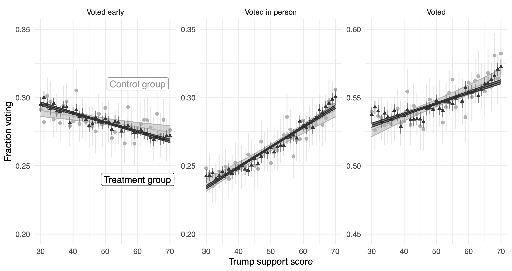

```{r setup, include=FALSE}
knitr::opts_chunk$set(echo = TRUE)
```

Aggarwal, Minali, Jennifer Allen, Andrew Beasley, James Barnes, Alexander Coppock, Dan Frankowski, Solomon Messing, Kelly Zhang, Sylvan Zheng. 2023. <b>The impact of digital advertising on turnout during the 2020 US presidential election: evidence from a massive campaign-level field experiment</b>. Nature Human Behavior.

# Abstract
We present the results of a large, $8.9million campaign-wide field experiment, conducted among 2 million moderate- and low-information persuadable voters in five battleground states during the 2020 US presidential election. Treatment group participants were exposed to an 8-month-long advertising programme delivered via social media, designed to persuade people to vote against Donald Trump and for Joe Biden. We found no evidence that the programme increased or decreased turnout on average. We found evidence of differential turnout effects by modelled level of Trump support: the campaign increased voting among Biden leaners by 0.4 percentage points (s.e. = 0.2pp) and decreased voting among Trump leaners by 0.3 percentage points (s.e.= 0.3 pp) for a difference in conditional average treatment effects of 0.7 points (t 1,035,571= −2.09; P = 0.036; DIC = 0.7 points; 95% confidence interval = −0.014 to 0). An important but exploratory finding is that the strongest differential effects appear in early voting data, which may inform future work on early campaigning in a post-COVID electoral environment. Our results indicate that differential mobilization effects of even large digital advertising campaigns in presidential elections are likely to be modest.

# Links
 - <a href='aggarwal_etal_2023.pdf' target='_blank'>Link to paper</a>
 - <a href='aggarwal_etal_2023_appendix.pdf'target='_blank'>Link to appendix</a>
 - <a href='https://doi.org/10.1038/s41562-022-01487-4'target='_blank'>Journal site</a>
 - <a href='https://doi.org/10.7910/DVN/YMKVA1'target='_blank'>Replication archive</a>
 - <a href='https://osf.io/3evfp'target='_blank'>Preanalysis plan</a>
 - <a href='https://osf.io/jkush'target='_blank'>Preanalysis plan 2</a>

 - <a href= 'https://politicalscience.yale.edu/people/minali-aggarwal' target='_blank'>Minali Aggarwal's website</a>
 - <a href= 'http://jennyallen.github.io/' target='_blank'>Jennifer Allen's website</a>
 - <a href= 'https://scholar.google.com/citations?user=hHsXTVgAAAAJ&hl=en' target='_blank'>Dan Frankowski's website</a>
 - <a href= 'https://solomonmg.github.io/' target='_blank'>Solomon Messing's website</a>
 - <a href= 'https://mitgovlab.org/people/kelly-zhang/' target='_blank'>Kelly Zhang's website</a>
 - <a href='aggarwal_etal_2023.txt'target='_blank'>Bibtex citation</a>

# Figure
<center></center>