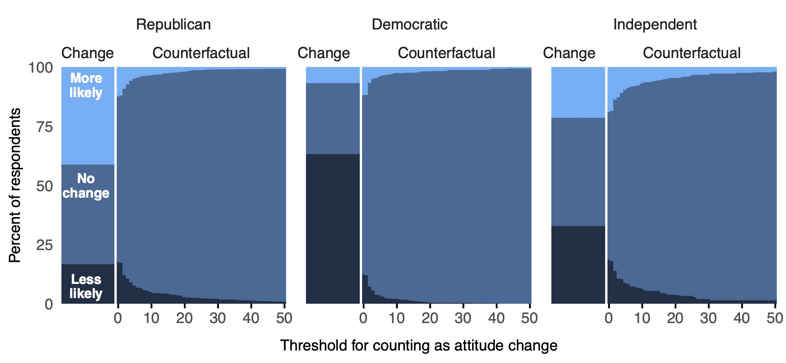

```{r setup, include=FALSE}
knitr::opts_chunk$set(echo = TRUE)
```

Barari, Soubhik, Coppock, Alexander, Graham, Matthew H., Padgett, Zoe. 2023. <b>Are Trump's Indictments Rallying His Base? Evidence from the Counterfactual Format</b>. Public Opinion Quarterly.

# Abstract
In the difficult task of assessing how sudden, significant events causally affect public attitudes, political pollsters often rely on respondents' retrospective and self-reported causal inferences. We study the case of former president Donald Trump’s federal indictment for allegedly mishandling classified documents using two methods of retrospective causal inference. The commonly used change format asks respondents to directly state how the event affected their attitudes. This format triggers overwhelmingly partisan reactions and implausibly large effects. By contrast, the counterfactual format asks respondents to imagine what their attitudes and beliefs would have been if the event had not happened. Contrary to popular claims, it suggests that the indictment modestly hurt Trump’s standing among Republicans, increasing their belief that he mishandled documents (+2.5 pp) and decreasing their intention to vote for him in the primaries (-1.6 pp). These results are consistent with earlier research on the change format, as well as the broader body of research on political persuasion and the effects of scandal. Our approach includes a new sensitivity analysis of the counterfactual format that demonstrates its ability to capture more granular opinion change.

# Links
 - <a href='barari_etal_2023_WP.pdf' target='_blank'>Link to paper</a>

 - <a href= 'https://soubhikbarari.com/' target='_blank'>Soubhik Barari's website</a>
 - <a href= 'http://m-graham.com' target='_blank'>Matthew H. Graham's website</a>
 - <a href= 'https://www.linkedin.com/in/zoe-padgett-26217260' target='_blank'>Zoe Padgett's website</a>
 - <a href='barari_etal_2023.txt'target='_blank'>Bibtex citation</a>

# Figure
<center></center>