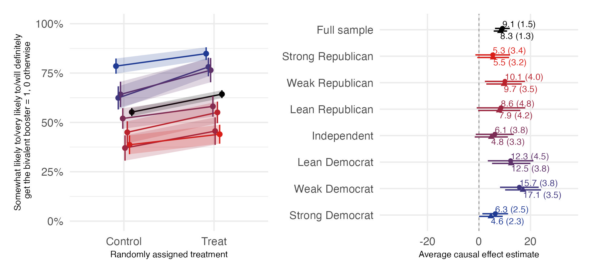

```{r setup, include=FALSE}
knitr::opts_chunk$set(echo = TRUE)
```

Baxter-King, Ryan, Coppock, Alexander, Straus, Graham, Vavreck, Lynn. 2025. <b>Endorsements vs. information: Experimental evidence of backlash and parallel persuasion during the COVID-19 public health crisis</b>. PNAS Nexus.

# Abstract
Governments try to promote prosocial behaviors like gun safety, environmental protection, opioid awareness, and during COVID-19 pandemic, behaviors like social distancing, masking, and vaccination. Democratic governments generally cannot force these behaviors on citizens; instead, they must persuade. Persuasive appeals mainly fall into three categories: endorsements (cues from leaders, experts, or celebrities), guidance and mandates (policies or practices issued by government), and information (the provision of facts and arguments about benefits). Using data from 10 experiments with 85,191 survey respondents conducted over a 2-year period during the COVID-19 pandemic, we assess the effectiveness of these three types of persuasive messages. We find that endorsements are variously polarizing depending on subjects’ partisan orientation toward the endorser, counterproductive in general, or wholly ineffective. We find that guidance and information treatments—when they are effective at all—move people ``in parallel,'' i.e., in the direction of information by similar amounts regardless of party affiliation.

# Links
 - <a href='baxter-king_etal_2025.pdf' target='_blank'>Link to paper</a>
 - <a href='baxter-king_etal_2025_appendix.pdf'target='_blank'>Link to appendix</a>
 - <a href='https://doi.org/10.1093/pnasnexus/pgaf185'target='_blank'>Journal site</a>
 - <a href='https://osf.io/bwv3c/'target='_blank'>Replication archive</a>

 - <a href= 'https://ryanbk.github.io/' target='_blank'>Ryan Baxter-King's website</a>
 - <a href= 'https://www.grahamstraus.com/' target='_blank'>Graham Straus's website</a>
 - <a href= 'https://www.vavreck.com' target='_blank'>Lynn Vavreck's website</a>
 - <a href='baxter-king_etal_2025.txt'target='_blank'>Bibtex citation</a>

# Figure
<center></center>