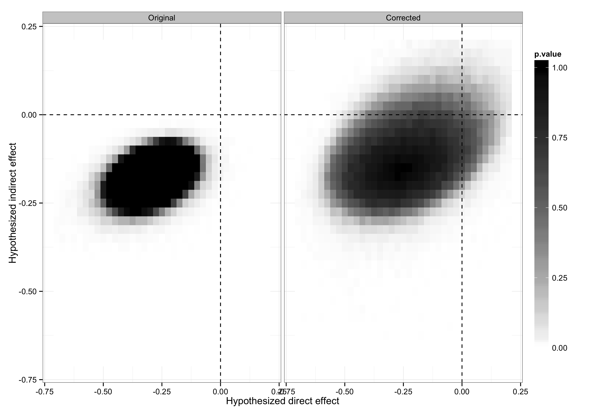

```{r setup, include=FALSE}
knitr::opts_chunk$set(echo = TRUE)
```

Coppock, Alexander. 2014. <b>Information Spillovers: Another Look at Experimental Estimates of Legislator Responsiveness</b>. Journal of Experimental Political Science.

# Abstract
A field experiment carried out by Butler and Nickerson (Butler, D. M., and Nickerson, D. W. (2011). Can learning constituency opinion affect how legislators vote? Results from a field experiment. Quarterly Journal of Political Science 6, 55–83) shows that New Mexico legislators changed their voting decisions upon receiving reports of their constituents' preferences. The analysis of the experiment did not account for the possibility that legislators may share information, potentially resulting in spillover effects. Working within the analytic framework proposed by Bowers et al. (2013), I find evidence of spillovers, and present estimates of direct and indirect treatment effects. The total causal effect of the experimental intervention appears to be twice as large as reported originally.

# Links
 - <a href='coppock_2014.pdf' target='_blank'>Link to paper</a>
 - <a href='coppock_2014_appendix.pdf'target='_blank'>Link to appendix</a>
 - <a href='https://doi.org/10.1017/xps.2014.9'target='_blank'>Journal site</a>
 - <a href='https://doi.org/10.7910/DVN/28664'target='_blank'>Replication archive</a>


 - <a href='coppock_2014.bib'target='_blank'>Bibtex citation</a>

# Figure
<center></center>