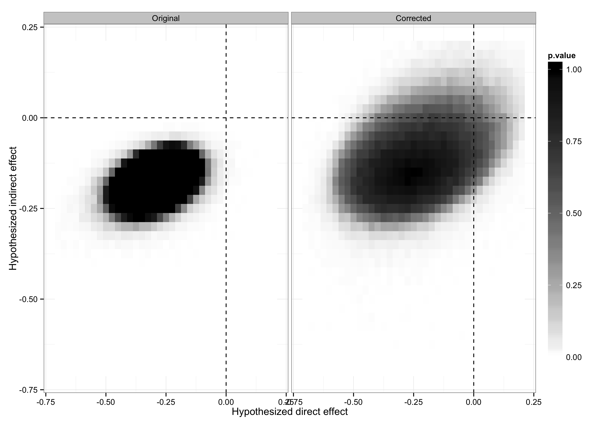

```{r setup, include=FALSE}
knitr::opts_chunk$set(echo = TRUE)
```

Coppock, Alexander. 2016. <b>Information Spillovers: Another Look at Experimental Estimates of Legislator Responsiveness---CORRIGENDUM</b>. Journal of Experimental Political Science.

# Abstract
In Coppock (2014), I presented a reanalysis of Butler and Nickerson (2011), a field experiment that tested the effects of providing state legislators district-level public opinion data on their roll call votes for a bill. The reanalysis employed a method introduced by Bowers, Fredrickson, and Panagopoulos (2013) to conclude that the Butler and Nickerson estimate of the total effect of treatment was biased downward; when spillovers were accounted for, the total effect of treatment was estimated to be nearly twice as large. Due to a coding error, the results presented in Figures 2 and 3 of Coppock (2014) were incorrect. The similarity matrix I used falsely implied that all legislators were equally close to one another in ideological space. When corrected, the uncertainty attending to the estimates of the indirect effects of information as transmitted via the Ideological Similarity spillover model is larger. In light of these updated results, I revise my conclusions regarding the transfer of information within the New Mexico state legislature during this experiment. There is insufficient statistical evidence to conclude that indirect exposure to information altered legislator behavior.

# Links
 - <a href='coppock_2016.pdf'>Link to paper</a>
 - Journal site: https://doi.org/10.1017/XPS.2016.8 
 - Replication archive: https://doi.org/10.7910/DVN/28664 


 - <a href='coppock_2016.bib'>Bibtex citation</a>

# Figure
<center></center>