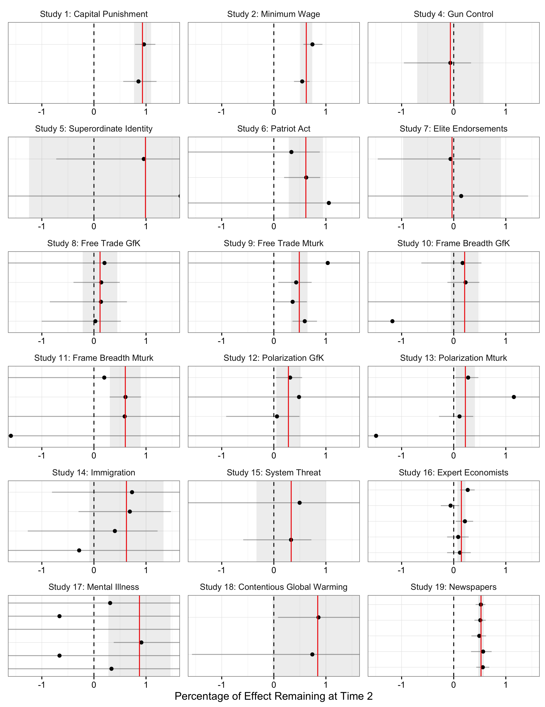

```{r setup, include=FALSE}
knitr::opts_chunk$set(echo = TRUE)
```

Coppock, Alexander. 2017. <b>The Persistence of Survey Experimental Treatment Effects</b>. Unpublished manuscript.

# Abstract
Do treatments deployed in survey experiments have persistent effects? The prototypical survey experiment collects background information, delivers experimental treatments, and records outcomes all in the space of a few minutes. Survey experimental treatments may cause real, underlying attitude change, or they may simply induce a temporary increase in subjects' probability of choosing one response over another. Further, some treatments may have more persistent effects than others. I hypothesize that priming and framing treatments that make certain considerations more accessible have fleeting effects whereas treatments that make considerations newly applicable or provide new information persist longer. Results from 18 panel survey experiments show that on average, survey experimental treatment effects persist after 10 days, albeit at approximately half their original magnitudes. This suite of evidence also provides strong support for the theory that information treatments have more persistent effects than framing treatments.

# Links
 - <a href='coppock_2017b.pdf' target='_blank'>Link to paper</a>
 - <a href='coppock_2017b_appendix.pdf'target='_blank'>Link to appendix</a>


 - <a href='coppock_2017b.bib'target='_blank'>Bibtex citation</a>

# Figure
<center></center>