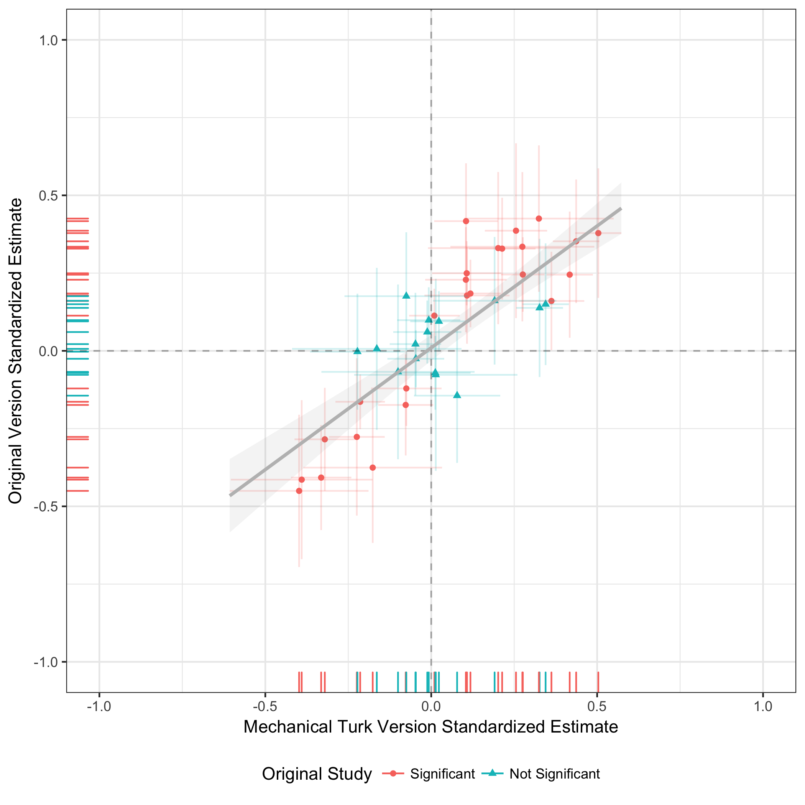

```{r setup, include=FALSE}
knitr::opts_chunk$set(echo = TRUE)
```

Coppock, Alexander. 2019. Generalizing from Survey Experiments Conducted on Mechanical Turk: A Replication Approach. Political Science Research and Methods.

# Abstract
To what extent do survey experimental treatment effect estimates generalize to other populations and contexts? Survey experiments conducted on convenience samples have often been criticized on the grounds that subjects are sufficiently different from the public at large to render the results of such experiments uninformative more broadly. In the presence of moderate treatment effect heterogeneity, however, such concerns may be allayed. I provide evidence from a series of 12 survey experiments that results derived from convenience samples like Amazon’s Mechanical Turk are similar to those obtained from national samples. These results suggest that either the treatments deployed in these experiments cause similar responses for many subject types or convenience and national samples do not differ much with respect to treatment effect moderators. Using evidence of moderate within-experiment heterogeneity, I show that the former is likely to be the case. Despite a wide diversity of background characteristics across samples, the effects uncovered in these experiments appear to be relatively homogeneous.

# Links
 - <a href='coppock_2019a.pdf'>Link to paper</a>
 - <a href='coppock_2019a_appendix.pdf'>Link to appendix</a>
 - Journal site: https://doi.org/10.1017/psrm.2018.10 
 - Replication archive: https://doi.org/10.7910/DVN/F1CFFM 


# Figure
<center></center>