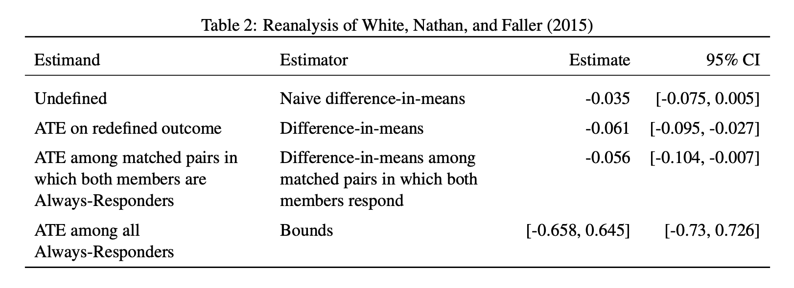

```{r setup, include=FALSE}
knitr::opts_chunk$set(echo = TRUE)
```

Coppock, Alexander. 2019. <b>Avoiding Post-Treatment Bias in Audit Experiments</b>. Journal of Experimental Political Science.

# Abstract
Audit experiments are used to easure discrimination in a large number of domains (Employment: Bertrand and Mullainathan (2004); Legislator responsiveness: Butler and Broockman (2011); Housing: Fang et al. (2018)). Audit studies all have in common that they estimate the average difference in response rates depending on randomly varied characteristics (such as the race or gender) of a requester. Scholars conducting audit experiments often seek to extend their analyses beyond the effect on response to the effects on the quality of the response. Response is a consequence of treatment; answering these important questions well is complicated by post-treatment bias (Montgomery et al., 2018). In this note, I consider a common form of post-treatment bias that occurs in audit experiments.

# Links
 - <a href='coppock_2019b.pdf'>Link to paper</a>
 - Journal site: https://doi.org/10.1017/XPS.2018.9 
 - Replication archive: https://doi.org/10.7910/DVN/6NVI9C 


# Figure
<center></center>