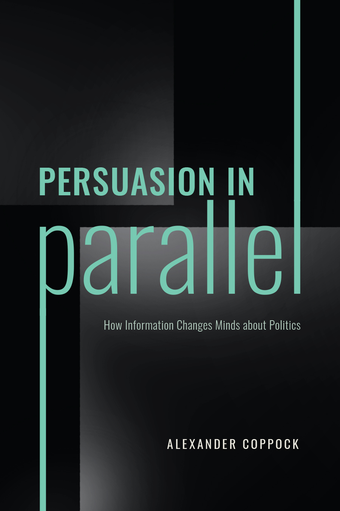

```{r setup, include=FALSE}
knitr::opts_chunk$set(echo = TRUE)
```

Alexander Coppock. 2022. <b>Persuasion in Parallel: How Information Changes Minds about Politics</b>. University of Chicago Press, Chicago Studies in American Politics.

# Figure
<center></center>

# Abstract

Many mistakenly believe that it is fruitless to try to persuade those who disagree with them about politics. However, Persuasion in Parallel shows that individuals do, in fact, change their minds in response to information, with partisans on either side of the political aisle updating their views roughly in parallel. This book challenges the dominant view that persuasive information can often backfire because people are supposedly motivated to reason against information they dislike. Drawing on evidence from a series of randomized controlled trials, the book shows that the backfire response is rare to nonexistent. Instead, it shows that most everyone updates in the direction of information, at least a little bit. The political upshot of this work is that the other side is not lost. Even messages we don’t like can move us in the right direction.

# Links

 - <a href='https://press.uchicago.edu/ucp/books/book/chicago/P/bo181475008.html'target='_blank'>Link to press</a>
 - <a href='https://www.amazon.com/Persuasion-Parallel-Information-Politics-American/dp/0226821846/ref=cm_cr_arp_d_product_top?ie=UTF8'target='_blank'>Amazon</a>
 - <a href='coppock_2022.txt'target='_blank'>Bibtex citation</a>

