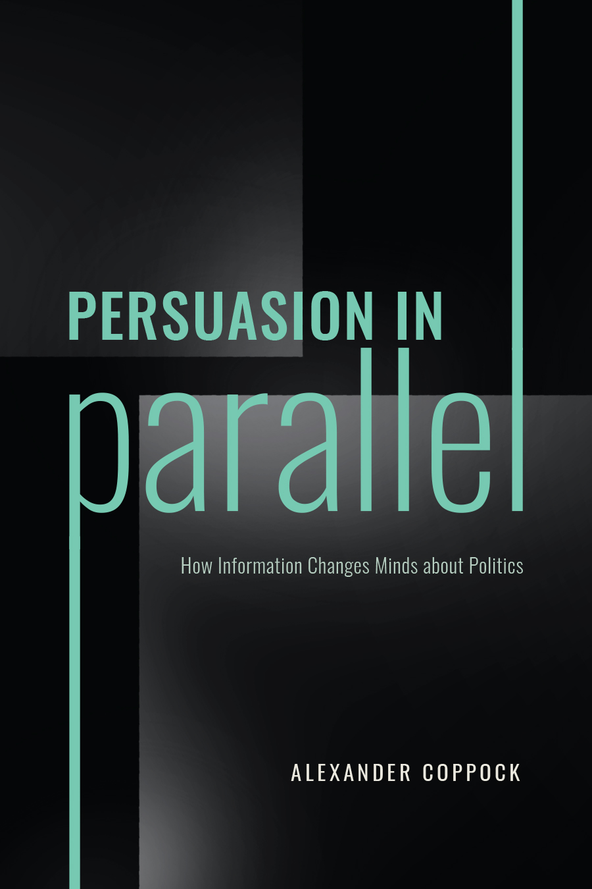

```{r setup, include=FALSE}
knitr::opts_chunk$set(echo = TRUE)
```

Alexander Coppock. 2023. <b>Persuasion in Parallel: How Information Changes Minds about Politics</b>. University of Chicago Press. Chicago, IL.

# Abstract

According to theories of motivated reasoning, attempts to persuade political opponents are often counterproductive because they end up strengthening opponents' initial views via directional motivations. Drawing on evidence from 23 randomized survey experiments, Persuasion in Parallel shows that the predicted "backlash" fails to materialize. Instead, the experiments show that the effects of persuasive messages are similar for many subdivisions of society, including policy opponents and proponents, Republicans and Democrats, young and old, and men and women. The overarching conclusion is that persuasion occurs in parallel: even though Americans differ tremendously in their baseline views on many political issues, they are quite similar in their responses to information. This empirical pattern casts serious doubt on the motivated reasoning framework for understanding information processing. The political implication of this work is that we should not give up trying to persuade the other side.

# Links
 
- <a href='persuasion_in_parallel_chapter_1.pdf' target='_blank'>Chapter 1 preprint</a>
- <a href='pip_conversation_among_critics.pdf' target='_blank'>APSA 2023 Conversation among critics</a>
- <a href='https://doi.org/10.1093/psquar/qqad076' target='_blank'>Matthew Levendusky's review in Political Science Quarterly</a>
- <a href='https://doi.org/10.1017/S1537592723001299' target='_blank'>Taylor Carlson's review in Perspectives on Politics</a>
- <a href='https://doi.org/10.7910/DVN/I9GSKI' target='_blank'>Replication archive</a>
- <a href='https://press.uchicago.edu/ucp/books/book/chicago/P/bo181475008.html' target='_blank'>Link to press</a>
- <a href='coppock_2023.txt'target='_blank'>Bibtex citation</a>
<center></center>


