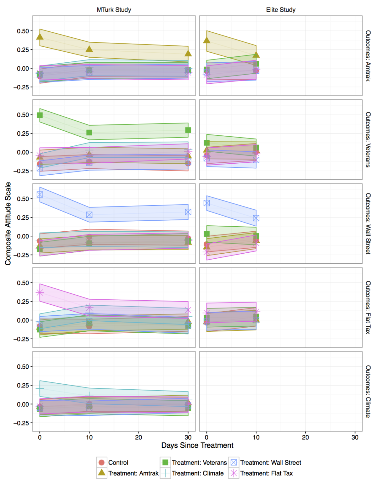

```{r setup, include=FALSE}
knitr::opts_chunk$set(echo = TRUE)
```

Coppock, Alexander, Emily Ekins, David Kirby. 2018. <b>The Long-lasting Effects of Newspaper Op-Eds on Public Opinion</b>. Quarterly Journal of Political Science.

# Abstract
Do newspaper opinion pieces change the minds of those who read them? We conduct two randomized panel survey experiments on elite and mass convenience samples to estimate the effects of five op-eds on policy attitudes. We find very large treatment effects on target issues, equivalent to shifts of 10 to 20 percentage points, that persist for at least one month. We find essentially no treatment effects on non-target issues, suggesting that our subjects read, understood, and were persuaded by the arguments presented in these op-eds. We find limited evidence of treatment effect heterogeneity by party identification: Democrats, Republicans and independents all appear to move in the predicted direction by similar magnitudes. We conduct this study on both a sample of Amazon Mechanical Turk workers and a sample of elites. Despite large differences in demographics and initial political beliefs, we find that op-eds were persuasive to both the mass public and elites, but marginally more persuasive among the mass public. Our findings add to the growing body of evidence of the everyday nature of persuasion.

# Links
 - <a href='coppock_ekins_kirby_2018.pdf'>Link to paper</a>
 - <a href='coppock_ekins_kirby_2018_appendix.pdf'>Link to appendix</a>
 - Journal site: https://doi.org/10.1561/100.00016112 
 - Replication archive: https://doi.org/10.7910/DVN/3KBCJF 
 - Preanalysis plan: https://osf.io/rmkw3 

- Emily Ekins's website: https://www.cato.org/people/emily-ekins
- David Kirby's website: https://www.cato.org/people/david-kirby
 - <a href='coppock_ekins_kirby_2018.bib'>Bibtex citation</a>

# Figure
<center></center>