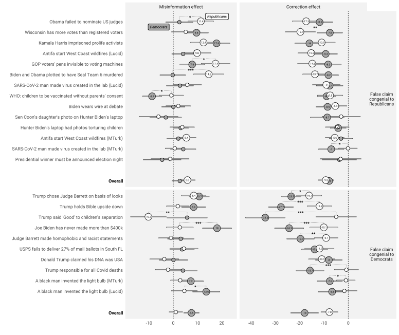

```{r setup, include=FALSE}
knitr::opts_chunk$set(echo = TRUE)
```

Coppock, Alexander, Gross, Kimberly, Porter, Ethan, Thorson, Emily, Wood, Thomas J.. 2023. <b>Conceptual Replication of Four Key Findings about Factual Corrections and Misinformation During the 2020 U.S. Election: Evidence from Panel Survey Experiments</b>. British Journal of Political Science.

# Abstract
NA

# Links
 - <a href='coppock_etal_2021_preprint.pdf' target='_blank'>Link to paper</a>
 - <a href='coppock_etal_2021_appendix.pdf'target='_blank'>Link to appendix</a>
 - <a href='https://doi.org/10.1017/S0007123422000631'target='_blank'>Journal site</a>
 - <a href='https://doi.org/10.7910/DVN/WQXZUP'target='_blank'>Replication archive</a>
 - <a href='https://osf.io/2hnv5'target='_blank'>Preanalysis plan</a>

 - <a href= 'https://smpa.gwu.edu/kimberly-gross' target='_blank'>Kimberly Gross's website</a>
 - <a href= 'http://www.ethanporter.com' target='_blank'>Ethan Porter's website</a>
 - <a href= 'https://www.maxwell.syr.edu/directory/emily-thorson' target='_blank'>Emily Thorson's website</a>
 - <a href= 'https://polisci.osu.edu/people/wood.1080' target='_blank'>Thomas J. Wood's website</a>
 - <a href='coppock_etal_2023.txt'target='_blank'>Bibtex citation</a>

# Figure
<center></center>