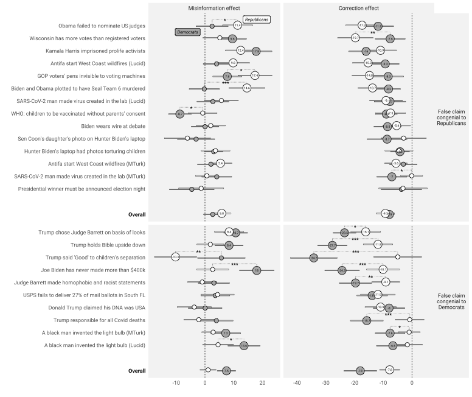

```{r setup, include=FALSE}
knitr::opts_chunk$set(echo = TRUE)
```

Coppock, Alexander, Gross, Kimberly, Porter, Ethan, Thorson, Emily, Wood, Thomas J.. 2023. <b>Conceptual Replication of Four Key Findings about Factual Corrections and Misinformation During the 2020 U.S. Election: Evidence from Panel Survey Experiments</b>. British Journal of Political Science.

# Abstract
In the final two months of the 2020 U.S. election, we conducted eight panel experiments to evaluate the immediate and medium-term effects of misinformation and factual corrections. Our results corroborate four sets of existing findings: fact-checks reliably improve factual accuracy, while misinformation degrades it; effects of fact-checks on belief accuracy endure, although they fade with time; effects on attitudes are minuscule; and there are important partisan asymmetries. We also offer one new empirical finding suggesting that effect heterogeneities by personality type and cognitive style may reflect attention paid to treatments. Our study confirms that the fundamental push and pull of misinformation and factual corrections on political beliefs holds even in electoral settings as saturated with mistruths as the 2020 U.S. election.

# Links
 - <a href='coppock_etal_2023.pdf' target='_blank'>Link to paper</a>
 - <a href='coppock_etal_2023_appendix.pdf'target='_blank'>Link to appendix</a>
 - <a href='https://doi.org/10.1017/S0007123422000631'target='_blank'>Journal site</a>
 - <a href='https://doi.org/10.7910/DVN/WQXZUP'target='_blank'>Replication archive</a>
 - <a href='https://osf.io/2hnv5'target='_blank'>Preanalysis plan</a>

 - <a href= 'https://smpa.gwu.edu/kimberly-gross' target='_blank'>Kimberly Gross's website</a>
 - <a href= 'http://www.ethanporter.com' target='_blank'>Ethan Porter's website</a>
 - <a href= 'https://www.maxwell.syr.edu/directory/emily-thorson' target='_blank'>Emily Thorson's website</a>
 - <a href= 'https://polisci.osu.edu/people/wood.1080' target='_blank'>Thomas J. Wood's website</a>
 - <a href='coppock_etal_2023.txt'target='_blank'>Bibtex citation</a>

# Figure
<center></center>