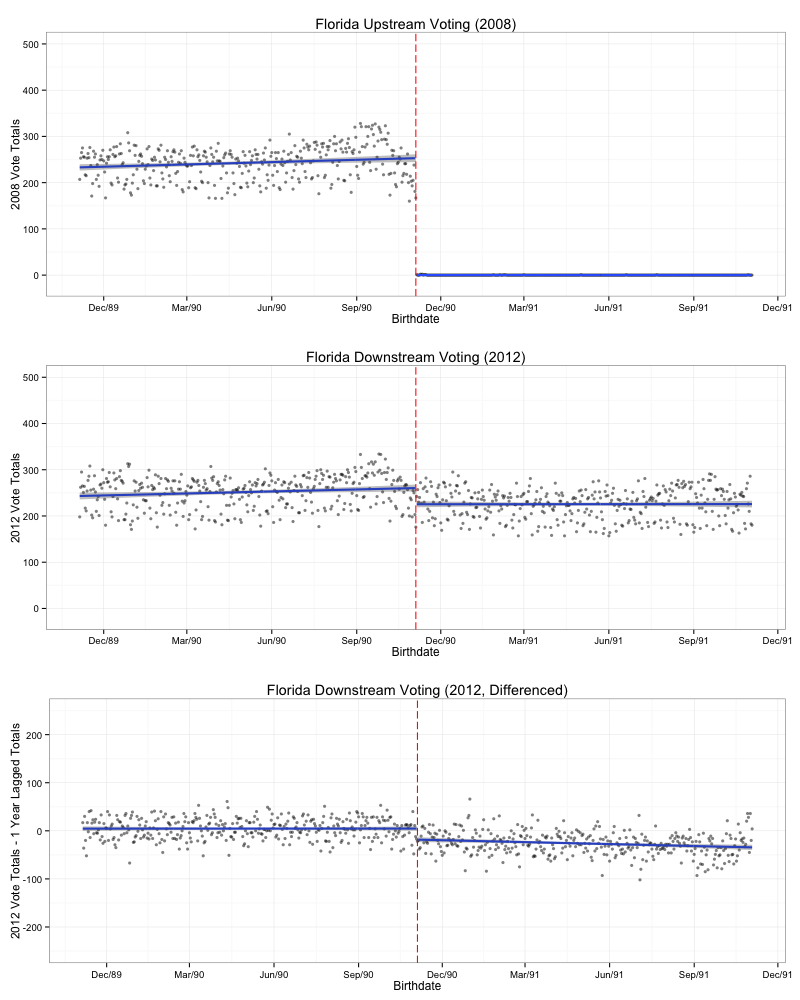

```{r setup, include=FALSE}
knitr::opts_chunk$set(echo = TRUE)
```

Coppock, Alexander, Green, Donald P.. 2016. <b>Is Voting Habit Forming? New Evidence from Experiments and Regression Discontinuities</b>. American Journal of Political Science.

# Abstract
Field experiments and regression discontinuity designs test whether voting is habit forming by examining whether a random shock to turnout in one election affects participation in subsequent elections. We contribute to this literature by offering a vast amount of new statistical evidence on the long-term consequences of random and quasi-random inducements to vote. The behavior of millions of voters confirms the persistence of voter turnout and calls attention to theoretically meaningful nuances in the development and expression of voting habits. We suggest that individuals become habituated to voting in particular types of elections. The degree of persistence appears to vary by electoral context and by the attributes of those who comply with an initial inducement to vote.

# Links
 - <a href='coppock_green_2016.pdf' target='_blank'>Link to paper</a>
 - <a href='coppock_green_2016_appendix.pdf'target='_blank'>Link to appendix</a>
 - <a href='https://doi.org/10.1111/ajps.12210'target='_blank'>Journal site</a>
 - <a href='https://doi.org/10.7910/DVN/ALZVAW'target='_blank'>Replication archive</a>

 - <a href= 'http://www.donaldgreen.com/' target='_blank'>Donald P. Green's website</a>
 - <a href='coppock_green_2016.txt'target='_blank'>Bibtex citation</a>

# Figure
<center></center>