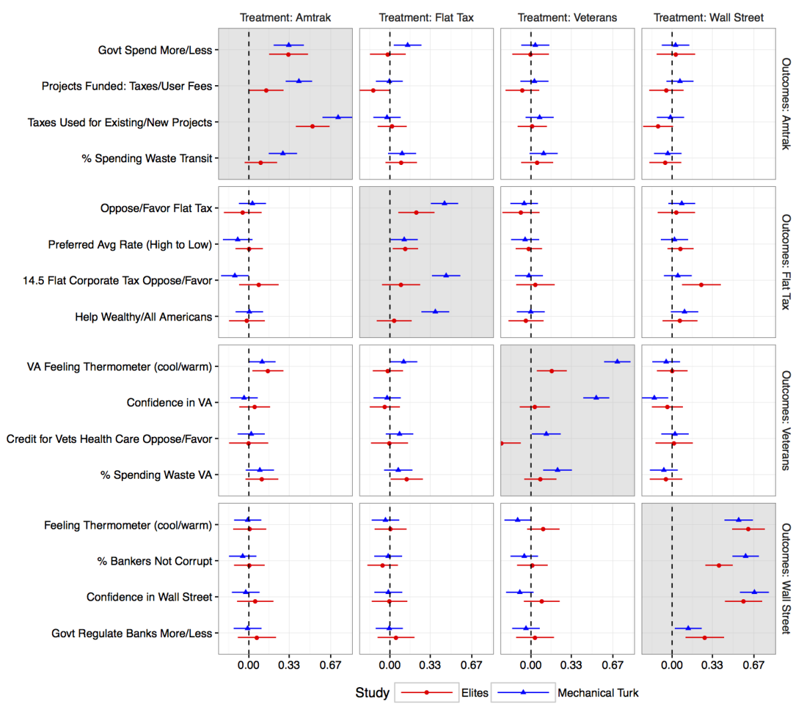

```{r setup, include=FALSE}
knitr::opts_chunk$set(echo = TRUE)
```

Coppock, Alexander, Donald P. Green. 2022. <b>Do Belief Systems Exhibit Dynamic Constraint?</b>. Journal of Politics.

# Abstract
Belief systems are said to be dynamically constrained if a change in one opinion causes a concomitant change in a related opinion. While an enormous literature is dedicated to the study of static constraint (the extent to which individuals holdpolitical views that "go together"), dynamic constraint is rarely studied, especially using experimental research designs. We present evidence from survey experiments conducted with convenience samples of both the mass public and of political elites. Our results indicate that even among respondents whose belief systems are constrained in the static sense, a change in one attitude need not precipitate changes in related attitudes. The lack of dynamic constraint among our elite sample raises the question of how they come to hold political opinions that are constrained in a static sense. We present an experiment that suggests a potential explanation: elites may be more likely to be chided for expressing inconsistent positions.

# Links
 - <a href='coppock_green_2022.pdf' target='_blank'>Link to paper</a>
 - <a href='coppock_green_2022_appendix.pdf'target='_blank'>Link to appendix</a>
 - <a href='https://doi.org/10.1086/716294'target='_blank'>Journal site</a>
 - <a href='https://doi.org/10.7910/DVN/NBMH7M'target='_blank'>Replication archive</a>
 - <a href='https://osf.io/vdcyq'target='_blank'>Preanalysis plan</a>
 - <a href='https://osf.io/ch4ms'target='_blank'>Preanalysis plan 2</a>

 - <a href= 'http://www.donaldgreen.com/' target='_blank'>Donald P. Green's website</a>
 - <a href='coppock_green_2022.txt'target='_blank'>Bibtex citation</a>

# Figure
<center></center>