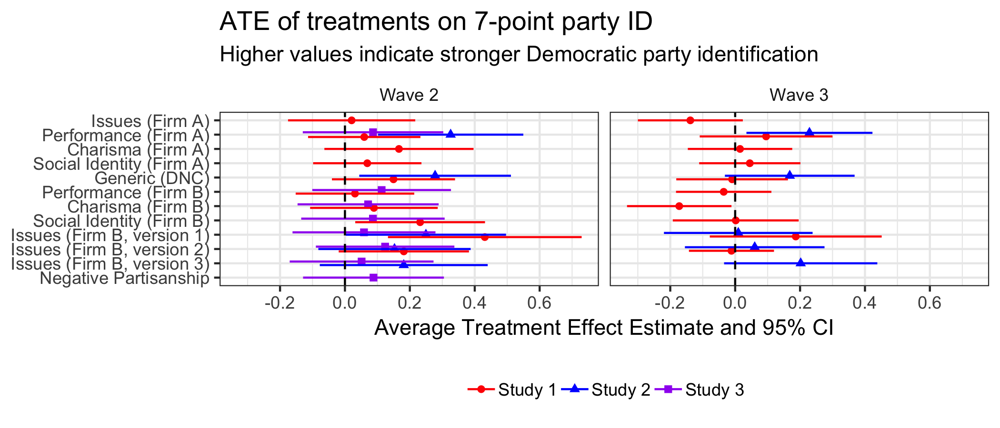

```{r setup, include=FALSE}
knitr::opts_chunk$set(echo = TRUE)
```

Coppock, Alexander, Donald P. Green, Ethan Porter. 2020. Minting Partisans: Experiments Testing Theories of Partisan Change. Unpublished manuscript.

# Abstract
Although partisan orientations are sometimes characterized as the unmoved movers of political evaluations and vote choice, it is clear from both panel surveys and aggregate time-series that partisan change does occur. To date, however, researchers have not attempted to integrate the many theories of partisan change into a systematic experimental research program investigating how partisan attitudes change in the wake of political messages. Guided by theories about issue proximity, performance evaluation, social identity, attraction to charismatic leaders, and ``the nature of the times,'' we worked with media consultants to develop persuasive political advertising designed to win partisan converts. These ads were deployed in a series of eight randomized survey experiments that tracked panel respondents over time in an effort to gauge the immediate and persistent effects of both message content and advertising dosage. We find that theoretically disparate messages work about equally well, producing small effects that accumulate and persist at high dosages. We conjecture that the zeitgeist conveyed by a preponderance of messages favoring one party may be the best available explanation of partisan change. We discuss the implications of the balance of partisan messaging for aggregate trends in partisanship.

# Links
 - <a href='coppock_green_porter_2020a.pdf'>Link to paper</a>
 - Preanalysis plan: https://osf.io/7hk25 

- Donald P. Green's website: https://sites.google.com/site/donaldpgreen/
- Ethan Porter's website: http://www.ethanporter.com

# Figure
<center></center>