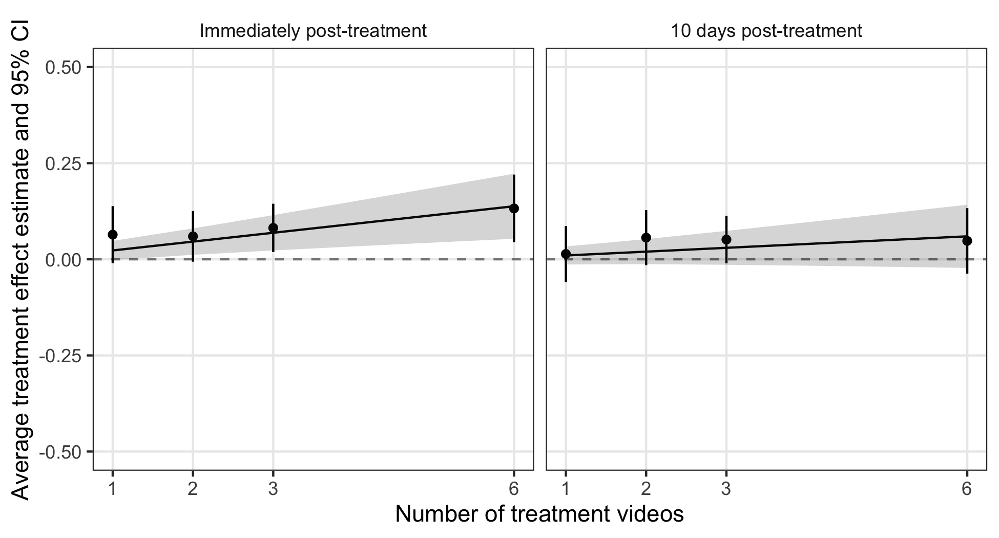

```{r setup, include=FALSE}
knitr::opts_chunk$set(echo = TRUE)
```

Coppock, Alexander, Donald P. Green, Ethan Porter. 2021. <b>Can Video Advertisements Change Partisanship? Results From Panel Survey Experiments</b>. Unpublished manuscript.

# Abstract
UPDATE: Please see updated paper for a description of a differential attrition problem that will require changes to the analysis and further experimentation. Although partisan orientations are sometimes characterized as the unmoved movers of political evaluations and vote choice, both panel surveys and aggregate time-series indicate that partisan change does occur. To date, however, researchers have seldom attempted to induce a change in partisanship experimentally. Guided by longstanding explanations of how people come to acquire and update their partisan attachments, we worked with media consultants to develop persuasive political advertising designed to win partisan converts. These video ads were deployed in a series of multi-wave survey experiments that tracked panel respondents over time in an effort to gauge the messages' immediate and persistent effects on party identification, as well as their downstream effects on political evaluations and voting preferences. We find that party-focused messaging operates as theoretically expected, especially at high dosages, producing small but demonstrable effects on partisanship with downstream consequences for political preferences. The fact that these effects dissipate over time helps illuminate individual- and aggregate-level patterns of partisan change.

# Links
 - <a href='coppock_green_porter_2021.pdf' target='_blank'>Link to paper</a>
 - <a href='coppock_green_porter_2021_appendix.pdf'target='_blank'>Link to appendix</a>
 - <a href='https://osf.io/7hk25'target='_blank'>Preanalysis plan</a>

 - <a href= 'http://www.donaldgreen.com/' target='_blank'>Donald P. Green's website</a>
 - <a href= 'http://www.ethanporter.com' target='_blank'>Ethan Porter's website</a>
 - <a href='coppock_green_porter_2021.bib'target='_blank'>Bibtex citation</a>

# Figure
<center></center>