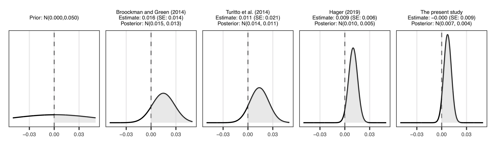

```{r setup, include=FALSE}
knitr::opts_chunk$set(echo = TRUE)
```

Coppock, Alexander, Donald P. Green, Ethan Porter. 2022. <b>Does Digital Advertising Affect Vote Choice? Evidence from a Randomized Field Experiment</b>. Research \& Politics.

# Abstract
Despite the increasing sums devoted to online political advertising, our understanding of the persuasive effects of such advertising is limited. We report the results of a ZIP code level randomized field experiment conducted over Facebook and Instagram during the 2018 U.S. midterm elections in Florida. The ads, produced by a Democratic-leaning political action committee, were designed to spur Democratic vote share and were seen more than 1.1 million times with over 100,000 full views. This wide saturation notwithstanding, we find that that these advertisements had very small estimated effects on Democratic vote share at the precinct level (-0.04 percentage points, SE: 0.85 points). Our results underline the challenges of political persuasion via digital advertisements, particularly in competitive electoral contexts.

# Links
 - <a href='coppock_green_porter_2022.pdf' target='_blank'>Link to paper</a>
 - <a href='coppock_green_porter_2022_appendix.pdf'target='_blank'>Link to appendix</a>
 - <a href='https://doi.org/10.7910/DVN/UH2NQW'target='_blank'>Replication archive</a>
 - <a href='https://osf.io/ch4ms'target='_blank'>Preanalysis plan</a>

 - <a href= 'http://www.donaldgreen.com/' target='_blank'>Donald P. Green's website</a>
 - <a href= 'http://www.ethanporter.com' target='_blank'>Ethan Porter's website</a>
 - <a href='coppock_green_porter_2022.txt'target='_blank'>Bibtex citation</a>

# Figure
<center></center>