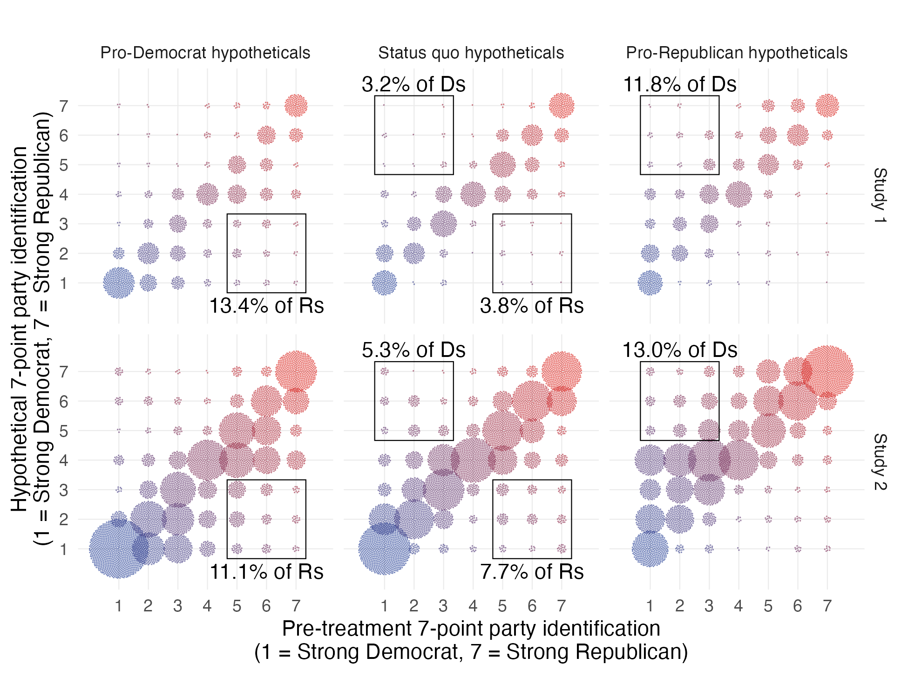

```{r setup, include=FALSE}
knitr::opts_chunk$set(echo = TRUE)
```

Coppock, Alexander, Donald P. Green, Ethan Porter. 2026. <b>Americans Can Imagine Changing Partisan Affiliation: Evidence from Hypothetical Scenarios</b>. Quarterly Journal of Political Science.

# Abstract
While attempts to change Americans’ partisanship via persuasive treatments largely fail, partisanship can and does change over time. In this paper, we first confirm, via survey and field experiments, that typical campaign messaging in the United States does not budge partisan- ship. We then present experiments in which participants encounter extraordinary hypothetical scenarios (e.g., one party causes economic collapse) before reporting what their partisanship would be under such circumstances. Twelve percent of partisans imagine switching parties in our pro-out-party hypothetical conditions, compared with five percent in our control hypotheti- cals in which the status quo persists, for a 7 percentage point (SE 1.5 points) difference. These hypothetical shifts are on par with the largest changes in American macropartisanship ever recorded. While the act of ruminating on hypothetical scenarios is not followed by changes in partisanship measured post-treatment, our evidence suggests that extraordinary world events may be able to shift partisanship.

# Links
 - <a href='coppock_green_porter_2026_preprint.pdf' target='_blank'>Link to paper</a>
 - <a href='coppock_green_porter_2026_appendix.pdf'target='_blank'>Link to appendix</a>
 - <a href='https://osf.io/nvmza'target='_blank'>Preanalysis plan</a>

 - <a href= 'http://www.donaldgreen.com/' target='_blank'>Donald P. Green's website</a>
 - <a href= 'http://www.ethanporter.com' target='_blank'>Ethan Porter's website</a>
 - <a href='coppock_green_porter_2026.txt'target='_blank'>Bibtex citation</a>

# Figure
<center></center>