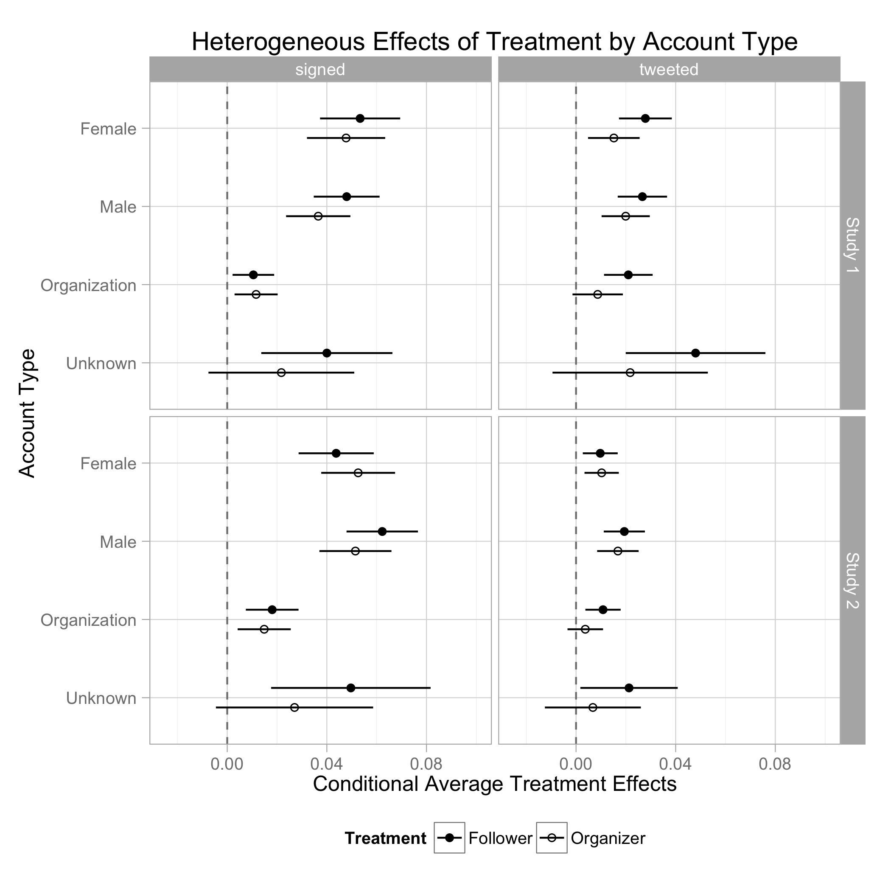

```{r setup, include=FALSE}
knitr::opts_chunk$set(echo = TRUE)
```

Coppock, Alexander, Andrew Guess, John Ternovski. 2016. <b>When Treatments are Tweets: A Network Mobilization Experiment over Twitter</b>. Political Behavior.

# Abstract
This study rigorously compares the effectiveness of online mobilization appeals via two randomized field experiments conducted over the social microblogging service Twitter. In the process, we demonstrate a methodological innovation designed to capture social effects by exogenously inducing network behavior. In both experiments, we find that direct, private messages to followers of a nonprofit advocacy organization's Twitter account are highly effective at increasing support for an online petition. Surprisingly, public tweets have no effect at all. We additionally randomize the private messages to prime subjects with either a "follower" or an "organizer" identity but find no evidence that this affects the likelihood of signing the petition. Finally, in the second experiment, followers of subjects induced to tweet a link to the petition are more likely to sign it - evidence of a campaign gone "viral." In presenting these results, we contribute to a nascent body of experimental literature exploring political behavior in online social media.

# Links
 - <a href='coppock_guess_ternovski_2016.pdf' target='_blank'>Link to paper</a>
 - <a href='coppock_guess_ternovski_2016_appendix.pdf'target='_blank'>Link to appendix</a>
 - <a href='https://doi.org/10.1007/s11109-015-9308-6'target='_blank'>Journal site</a>
 - <a href='https://doi.org/10.7910/DVN/29548'target='_blank'>Replication archive</a>

 - <a href= 'https://andyguess.com' target='_blank'>Andrew Guess's website</a>
 - <a href= 'http://www.jter.co' target='_blank'>John Ternovski's website</a>
 - <a href='coppock_guess_ternovski_2016.txt'target='_blank'>Bibtex citation</a>

# Figure
<center></center>