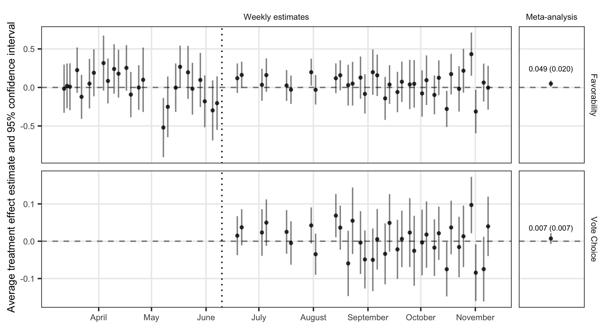

```{r setup, include=FALSE}
knitr::opts_chunk$set(echo = TRUE)
```

Coppock, Alexander, Seth J. Hill, Lynn Vavreck. 2020. The Small Effects of Political Advertising are Small Regardless of Context, Message, Sender, or Receiver: Evidence from 59 Real-time Randomized Experiments. Science Advances.

# Abstract
Evidence across social science indicates that average effects of persuasive messages are small. One commonly-offered explanation for these small effects is heterogeneity: persuasion may only work well in specific circumstances. To evaluate heterogeneity, we repeated an experiment weekly in real time using 2016 U.S. presidential election campaign advertisements. We tested 49 political advertisements in 59 unique experiments on 34,000 people. We investigate heterogeneous effects by sender (candidates or groups), receiver (subject partisanship), content (attack or promotional), and context (battleground versus non-battleground; primary versus general election; early versus late). We find small average effects on candidate favorability and vote. These small effects, however, do not mask substantial heterogeneity even where theory from political science suggests we should. During the primary and general election, in battleground states, for Democrats, Republicans, and Independents --- effects are similarly small. Heterogeneity with large offsetting effects is not the source of small average effects.

# Links
 - <a href='coppock_hill_vavreck_2020.pdf'>Link to paper</a>
 - <a href='coppock_hill_vavreck_2020_appendix.pdf'>Link to appendix</a>
 - Replication archive: https://doi.org/10.7910/DVN/TN7KWR 

- Seth J. Hill's website: https://www.sethjhill.com
- Lynn Vavreck's website: https://www.lynnvavreck.com

# Figure
<center></center>