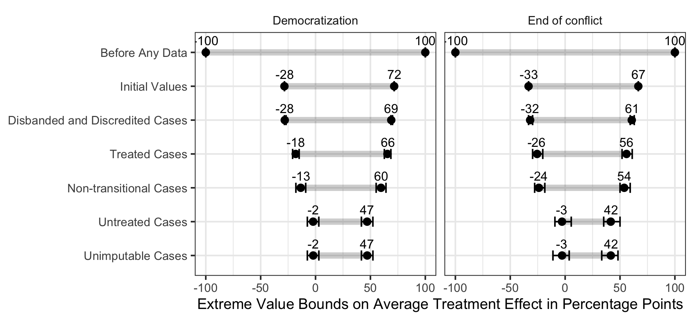

```{r setup, include=FALSE}
knitr::opts_chunk$set(echo = TRUE)
```

Coppock, Alexander, Dipin Kaur. 2020. Qualitative Imputation of Missing Potential Outcomes. Unpublished manuscript.

# Abstract
We propose a framework for meta-analysis of qualitative causal inferences. We integrate qualitative counterfactual inquiry with an approach from the quantitative causal inference literature for reasoning about missing information called extreme value bounds. Under the Neyman-Rubin model, units are endowed with potential outcomes, or responses that units would express depending on the level of some treatment. The goal of qualitative counterfactual analysis is to use the observed outcome and auxiliary information to infer what would have happened had the treatment been set to a different level. In other words, the analyst attempts to impute missing potential outcomes. Imputation is hard and when it fails, we can fill in the missing potential outcomes with best- and worst-case scenarios. We show how the resulting extreme value bounds represent fundamental uncertainty and how the imputation of missing potential outcomes can shrink that uncertainty in a structured manner. We provide an application of our approach to 121 cases that could have experienced transitional truth commissions, 16 of which did. Prior to any analysis, the extreme value bounds around the average treatment effect are 100 percentage points wide; incorporating qualitative beliefs about counterfactuals shrinks the width of these bounds to approximately 40 points.

# Links
 - <a href='coppock_kaur_2020.pdf'>Link to paper</a>
 - <a href='coppock_kaur_2020_appendix.pdf'>Link to appendix</a>

- Dipin Kaur's website: https://politicalscience.yale.edu/people/dipin-kaur

# Figure
<center></center>