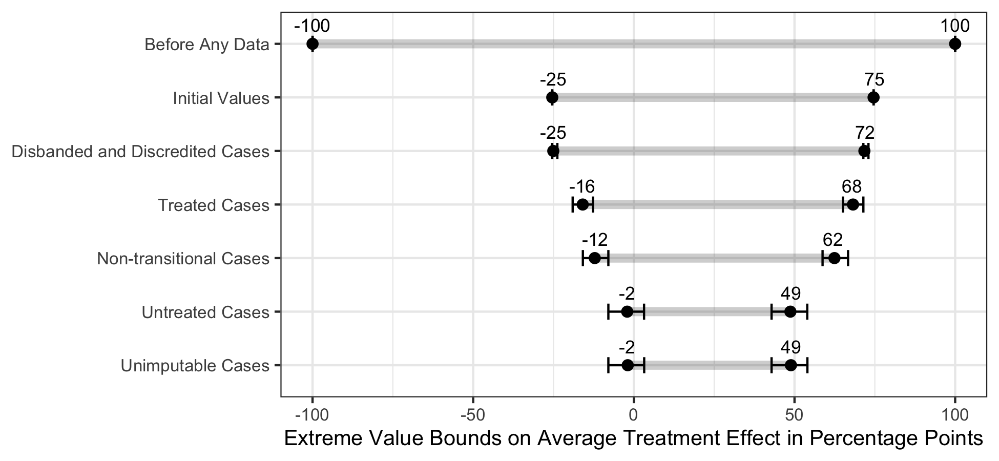

```{r setup, include=FALSE}
knitr::opts_chunk$set(echo = TRUE)
```

Coppock, Alexander, Dipin Kaur. 2021. <b>Qualitative Imputation of Missing Potential Outcomes</b>. American Journal of Political Science.

# Abstract
We propose a framework for meta-analysis of qualitative causal inferences. We integrate qualitative counterfactual inquiry with an approach from the quantitative causal inference literature called extreme value bounds. Qualitative counterfactual analysis uses the observed outcome and auxiliary information to infer what would have happened had the treatment been set to a different level. Imputing missing potential outcomes is hard and when it fails, we can fill them in under best- and worst-case scenarios. We apply our approach to 63 cases that could have experienced transitional truth commissions upon democratization, 8 of which did. Prior to any analysis, the extreme value bounds around the average treatment effect on authoritarian resumption are 100 percentage points wide; imputation shrinks the width of these bounds to 51 points. We further demonstrate our method by aggregating specialists' beliefs about causal effects gathered through an expert survey, shrinking the width of the bounds to 44 points.

# Links
 - <a href='coppock_kaur_2021.pdf' target='_blank'>Link to paper</a>
 - <a href='coppock_kaur_2021_appendix.pdf'target='_blank'>Link to appendix</a>

 - <a href= 'https://politicalscience.yale.edu/people/dipin-kaur' target='_blank'>Dipin Kaur's website</a>
 - <a href='coppock_kaur_2021.txt'target='_blank'>Bibtex citation</a>

# Figure
<center></center>