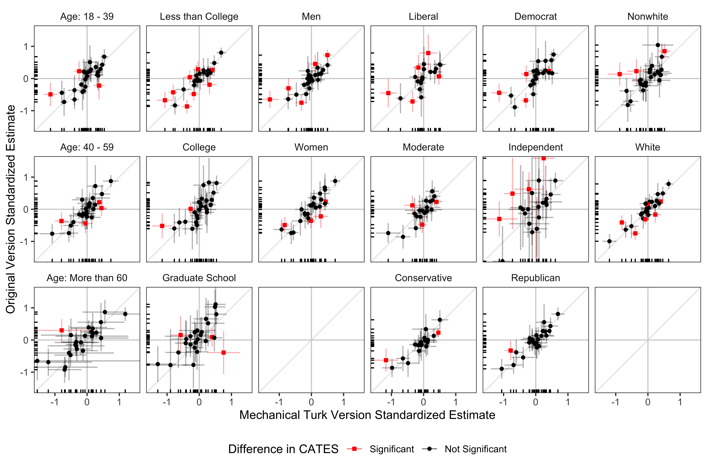

```{r setup, include=FALSE}
knitr::opts_chunk$set(echo = TRUE)
```

Coppock, Alexander, Leeper, Thomas J., Mullinix, Kevin J.. 2018. <b>Generalizability of Heterogeneous Treatment Effect Estimates Across Samples</b>. Proceedings of the National Academy of Sciences.

# Abstract
The extent to which survey experiments conducted with non-representative convenience samples are generalizable to target populations depends critically on the degree of treatment effect heterogeneity. Recent inquiries have found a strong correspondence between *sample average treatment effects* estimated in nationally-representative experiments and in replication studies conducted with convenience samples. We consider here two possible explanations: low levels of effect heterogeneity or high levels of effect heterogeneity that are unrelated to selection into the convenience sample. We analyze subgroup conditional average treatment effects using 27 original-replication study pairs (encompassing 101,745 individual survey responses) to assess the extent to which subgroup effect estimates generalize. While there are exceptions, the overwhelming pattern that emerges is one of treatment effect homogeneity, providing a partial explanation for strong correspondence across both unconditional and conditional average treatment effect estimates.

# Links
 - <a href='coppock_leeper_mullinix_2018.pdf'>Link to paper</a>
 - <a href='coppock_leeper_mullinix_2018_appendix.pdf'>Link to appendix</a>
 - Journal site: https://doi.org/10.1073/pnas.1808083115 
 - Replication archive: https://doi.org/10.7910/DVN/4WNGEJ 

- Thomas J. Leeper's website: https://thomasleeper.com
- Kevin J. Mullinix's website: https://kevinmullinix.com
 - <a href='coppock_leeper_mullinix_2018.bib'>Bibtex citation</a>

# Figure
<center></center>