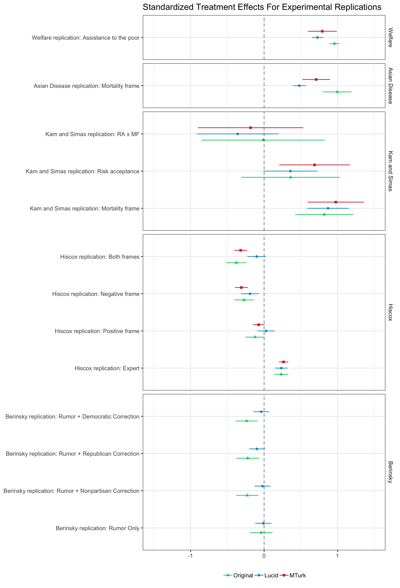

```{r setup, include=FALSE}
knitr::opts_chunk$set(echo = TRUE)
```

Coppock, Alexander, Oliver A. McClellan. 2019. <b>Validating the Demographic, Political, Psychological, and Experimental Results Obtained from a New Source of Online Survey Respondents</b>. Research \& Politics.

# Abstract
Researchers have increasingly turned to online convenience samples as sources of survey responses that are easy and inexpensive to collect. As reliance on these sources has grown, so too have concerns about the use of convenience samples in general and Amazon's Mechanical Turk in particular. We distinguish between "external validity" and theoretical relevance, with the latter being the more important justification for any data collection strategy. We explore an alternative source of online convenience samples, the Lucid Fulcrum Exchange, and assess its suitability for online survey experimental research. Our point of departure is Berinsky et al. (2012), which compares Amazon's Mechanical Turk to US national probability samples in terms of respondent characteristics and treatment effect estimates. We replicate these same analyses using a large sample of survey responses on the Lucid platform. Our results indicate that demographic and experimental findings on Lucid track well with US national benchmarks, with the exception of experimental treatments that aim to dispel the ``death panel'' rumor regarding the Affordable Care Act. We conclude that subjects recruited from the Lucid platform constitute a sample that is suitable for evaluating many social scientific theories, and can serve as a drop-in replacement for many scholars currently conducting research on Mechanical Turk or other similar platforms.

# Links
 - <a href='coppock_mcclellan_2019.pdf' target='_blank'>Link to paper</a>
 - <a href='coppock_mcclellan_2019_appendix.pdf'target='_blank'>Link to appendix</a>
 - <a href='https://doi.org/10.1177/2053168018822174'target='_blank'>Journal site</a>
 - <a href='https://doi.org/10.7910/DVN/DDWWJW'target='_blank'>Replication archive</a>

 - <a href= 'https://scholar.google.com/citations?user=qVR1Ek0AAAAJ&hl=en' target='_blank'>Oliver A. McClellan's website</a>
 - <a href='coppock_mcclellan_2019.bib'target='_blank'>Bibtex citation</a>

# Figure
<center></center>