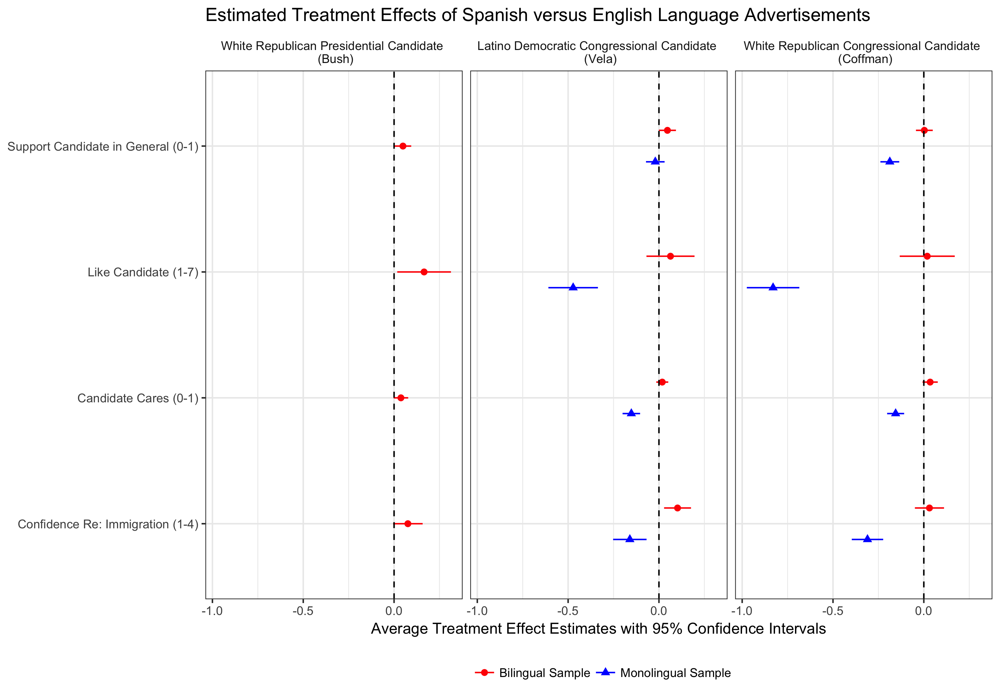

```{r setup, include=FALSE}
knitr::opts_chunk$set(echo = TRUE)
```

Alejandro Flores, Alexander Coppock. 2018. Do Bilinguals Respond More Favorably to Candidate Advertisements in English or in Spanish?. Political Communication.

# Abstract
Candidates for political office in the United States can appeal to constituents in either English or in Spanish. We investigate the consequences of this choice in a series of survey experiments conducted on large, diverse samples of both monolingual and bilingual Americans. We take advantage of parallel advertisements produced in both English and Spanish by real candidates for national office - one presidential and two congressional. Because our design holds constant candidates' policy positions, we can attribute the effects on vote choice directly to the choice of language over and above other candidate attributes. In two of our three experiments, the Spanish-language advertisements increased candidates' electoral support by 5 percentage points among bilinguals. We find the opposite pattern of results among English-speaking monolingual Americans, who respond very negatively to Spanish language advertisements. Our results shed light on the strategic calculus of candidates who must appeal to multiple linguistic communities at once.

# Links
 - <a href='flores_and_coppock_2018.pdf'>Link to paper</a>
 - <a href='flores_and_coppock_2018_appendix.pdf'>Link to appendix</a>
 - Journal site: https://doi.org/10.1080/10584609.2018.1426663 
 - Replication archive: https://doi.org/10.7910/DVN/XGQ2ZA 
 - Preanalysis plan: https://osf.io/e6zjk 

- Alejandro Flores's website: https://political-science.uchicago.edu/directory/alejandro-flores

# Figure
<center></center>