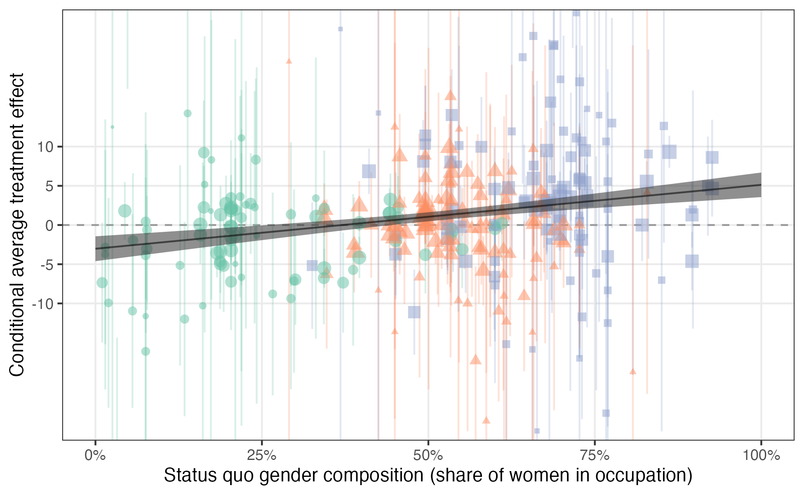

```{r setup, include=FALSE}
knitr::opts_chunk$set(echo = TRUE)
```

Galos, Diana Roxana, Alexander Coppock. 2023. <b>Gender Composition Predicts Gender Bias: A Meta-reanalysis of Hiring Discrimination Audit Experiments</b>. Science Advances.

# Abstract
Since 1983, over 70 employment audit experiments, carried out in more than 26 countries across five continents have randomized the gender of fictitious applicants to measure the extent of hiring discrimination on the basis of gender. The results are mixed: some studies find discrimination against men and others discrimination against women. We reconcile these heterogeneous findings through a "meta-reanalysis" of the average effects of being described as a woman (versus a man), conditional on occupation. We find a strongly positive gender gradient. In (relatively better paying) occupations dominated by men, the effect of being a woman is negative while in the (relatively lower paying) occupations dominated by women, the effect is positive. In this way, heterogeneous employment discrimination on the basis of gender preserves status quo gender distributions and earnings gaps. These patterns hold among both minority and majority status applicants.

# Links
 - <a href='galos_coppock_2023.pdf' target='_blank'>Link to paper</a>
 - <a href='galos_coppock_2023_appendix.pdf'target='_blank'>Link to appendix</a>
 - <a href='https://doi.org/10.1126/sciadv.ade7979'target='_blank'>Journal site</a>
 - <a href='https://doi.org/10.7910/DVN/5MCRNY'target='_blank'>Replication archive</a>

 - <a href= 'https://www.dianagalos.com/' target='_blank'>Diana Roxana Galos's website</a>
 - <a href='galos_coppock_2023.txt'target='_blank'>Bibtex citation</a>

# Figure
<center></center>