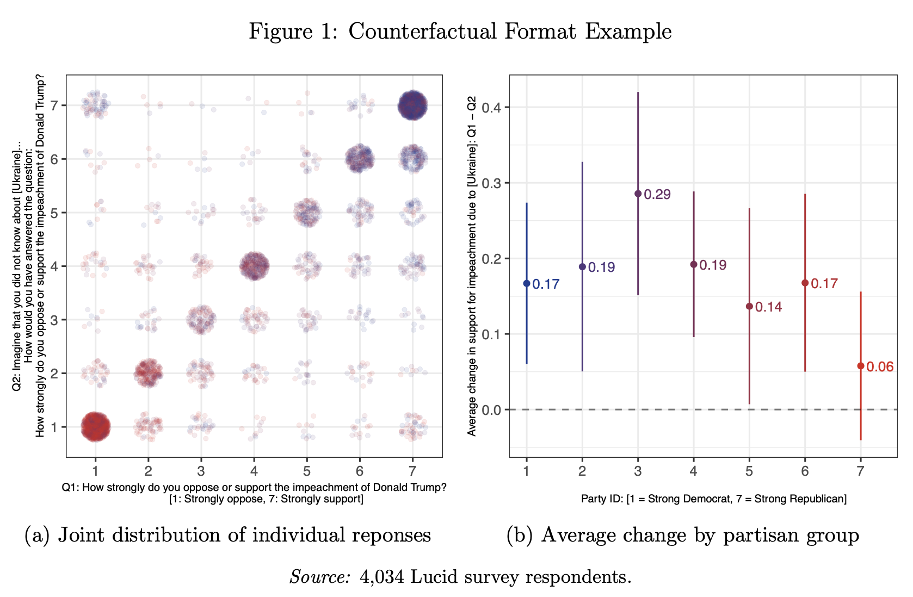

```{r setup, include=FALSE}
knitr::opts_chunk$set(echo = TRUE)
```

Graham, Matthew, Alexander Coppock. 2020. Asking About Attitude Change. Public Opinion Quarterly.

# Abstract
Surveys often ask respondents how information or events changed their attitudes. Does [information X] make you more or less supportive of [policy Y]? Does [scandal X] make you more or less likely to vote for [politician Y]? We show that this type of question (the change format) exhibits poor measurement properties, in large part because subjects engage in response substitution. When asked how their attitudes changed, people often appear to report the level of their attitudes rather than the change in them. As an alternative, we propose the counterfactual format, which asks subjects what their attitude would have been in the counterfactual world in which they did not know the treatment information. Using a series of experiments embedded in four studies, we show that the counterfactual format greatly reduces bias relative to the change format.

# Links
 - <a href='graham_and_coppock_2020.pdf'>Link to paper</a>
 - <a href='graham_and_coppock_2020_appendix.pdf'>Link to appendix</a>

- Matthew Graham's website: http://m-graham.com

# Figure
<center></center>