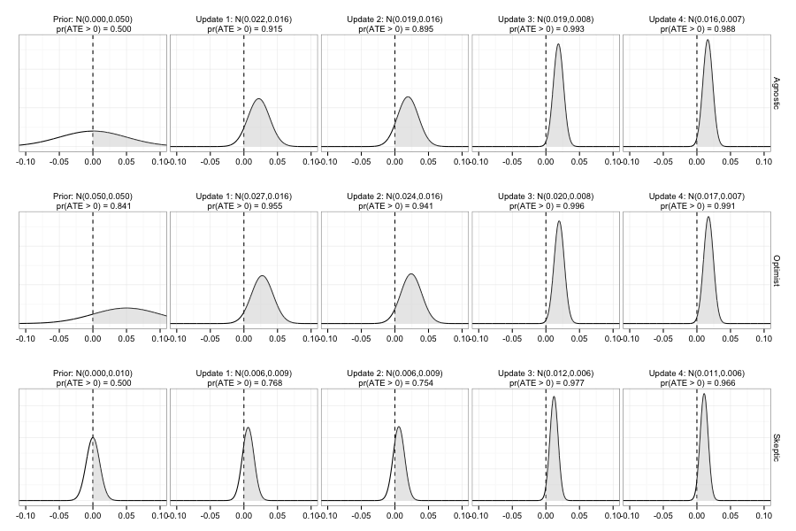

```{r setup, include=FALSE}
knitr::opts_chunk$set(echo = TRUE)
```

Green, Donald P., Jonathan S. Krasno, Alexander Coppock, Benjamin D. Farrer, Brandon Lenoir, Joshua N. Zingher. 2016. <b>The Effects of Lawn Signs on Vote Outcomes: Results from Four Randomized Field Experiments</b>. Electoral Studies.

# Abstract
Although lawn signs rank among the most widely used campaign tactics, little scholarly attention has been paid to the question of whether they actually generate votes. Working in collaboration with a congressional candidate, a mayoral candidate, an independent expenditure campaign directed against a gubernatorial candidate, and a candidate for county commissioner, we tested the effects of lawn signs by planting them in randomly selected voting precincts. Electoral results pooled over all four studies suggest that signs increased advertising candidates' vote shares. Results also provide some evidence that the effects of lawn signs spill over into adjacent untreated voting precincts.

# Links
 - <a href='green_etal_2016.pdf' target='_blank'>Link to paper</a>
 - <a href='green_etal_2016_appendix.pdf'target='_blank'>Link to appendix</a>
 - <a href='https://doi.org/10.7910/DVN/29984'target='_blank'>Journal site</a>
 - <a href='https://doi.org/10.7910/DVN/K2TLDB'target='_blank'>Replication archive</a>
 - <a href='https://osf.io/umysq'target='_blank'>Preanalysis plan</a>
 - <a href='https://osf.io/ejfgk'target='_blank'>Preanalysis plan 2</a>

 - <a href= 'http://www.donaldgreen.com/' target='_blank'>Donald P. Green's website</a>
 - <a href= 'https://www.binghamton.edu/political-science/people/faculty/jonathan-krasno.html' target='_blank'>Jonathan S. Krasno's website</a>
 - <a href= 'https://sites.google.com/a/binghamton.edu/benfarrer/home' target='_blank'>Benjamin D. Farrer's website</a>
 - <a href= 'http://www.highpoint.edu/presskit/2015/06/18/dr-brandon-lenoir-political-science-and-communication/' target='_blank'>Brandon Lenoir's website</a>
 - <a href= 'https://fs.wp.odu.edu/jzingher/' target='_blank'>Joshua N. Zingher's website</a>
 - <a href='green_etal_2016.txt'target='_blank'>Bibtex citation</a>

# Figure
<center></center>