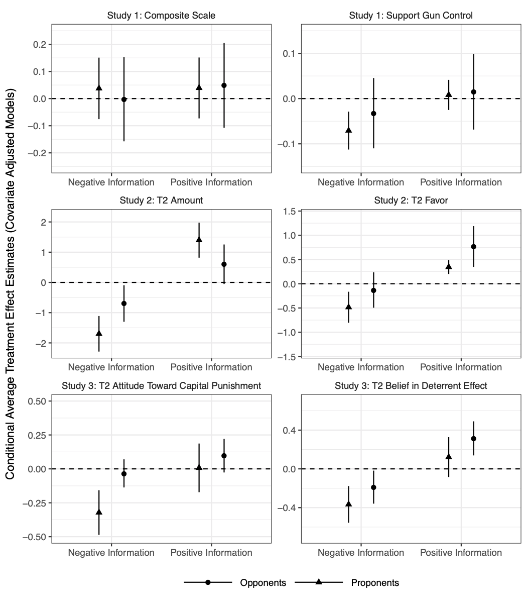

```{r setup, include=FALSE}
knitr::opts_chunk$set(echo = TRUE)
```

Guess, Andrew, Alexander Coppock. 2018. Does Counter-Attitudinal Information Cause Backlash? Results from Three Large Survey Experiments. British Journal of Political Science.

# Abstract
Several prominent theoretical perspectives suggest that when individuals are exposed to counterattitudinal evidence or arguments, their preexisting opinions and beliefs are reinforced, resulting in a phenomenon known as “backlash,” “backfire,” or “boomerang.” We investigate the prevalence of this effect. Should we expect that all attempts to persuade those who disagree will backfire? First, we formalize the concept of backlash and specify how it can be measured. We then present results from three survey experiments—two on Mechanical Turk and one on a nationally representative sample—in which we find no evidence of backlash, even under theoretically favorable conditions. While a casual reading of the literature on partisan information processing would lead one to conclude that backlash is rampant, we suspect that it is much rarer than commonly supposed. Researchers should continue to design well-powered randomized studies in order to better understand the specific conditions under which backlash is most likely to occur.

# Links
 - <a href='guess_coppock_2018.pdf'>Link to paper</a>
 - <a href='guess_coppock_2018_appendix.pdf'>Link to appendix</a>
 - Journal site: https://doi.org/10.1017/S0007123418000327 
 - Replication archive: https://doi.org/10.7910/DVN/J7WNTM 
 - Preanalysis plan: https://osf.io/y9vdr 
 - Preanalysis plan 2: https://osf.io/5gdes 

- Andrew Guess's website: https://andyguess.com

# Figure
<center></center>