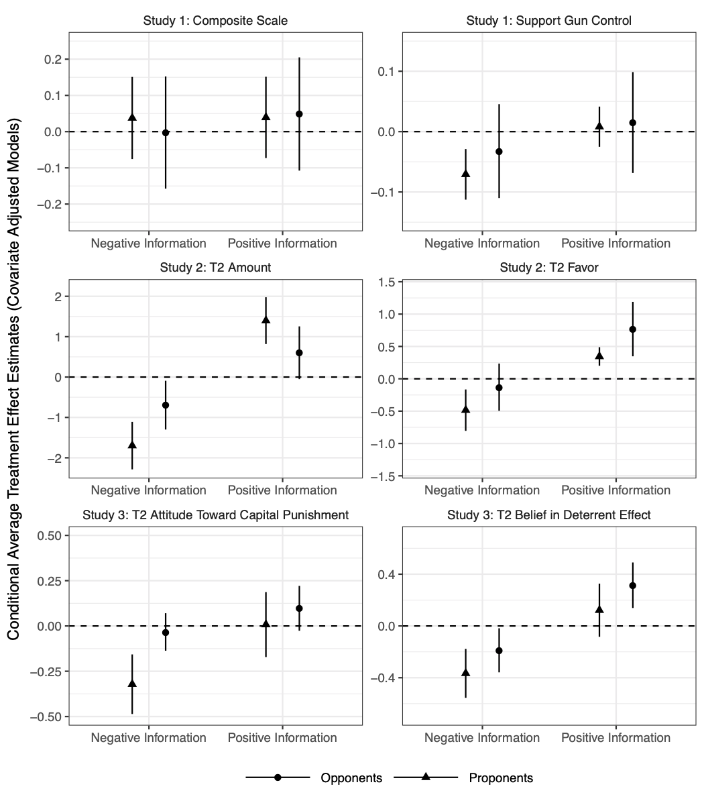

```{r setup, include=FALSE}
knitr::opts_chunk$set(echo = TRUE)
```

Guess, Andrew, Coppock, Alexander. 2020. <b>{Does Counter-Attitudinal Information Cause Backlash? Results from Three Large Survey Experiments}</b>. British Journal of Political Science.

# Abstract
NA

# Links
 - <a href='guess_coppock_2020.pdf' target='_blank'>Link to paper</a>
 - <a href='guess_coppock_2020_appendix.pdf'target='_blank'>Link to appendix</a>
 - <a href='https://doi.org/10.1017/S0007123418000327'target='_blank'>Journal site</a>
 - <a href='https://doi.org/10.7910/DVN/J7WNTM'target='_blank'>Replication archive</a>
 - <a href='https://osf.io/y9vdr'target='_blank'>Preanalysis plan</a>
 - <a href='https://osf.io/5gdes'target='_blank'>Preanalysis plan 2</a>

 - <a href= 'https://andyguess.com' target='_blank'>Andrew Guess's website</a>
 - <a href='guess_coppock_2020.txt'target='_blank'>Bibtex citation</a>

# Figure
<center></center>