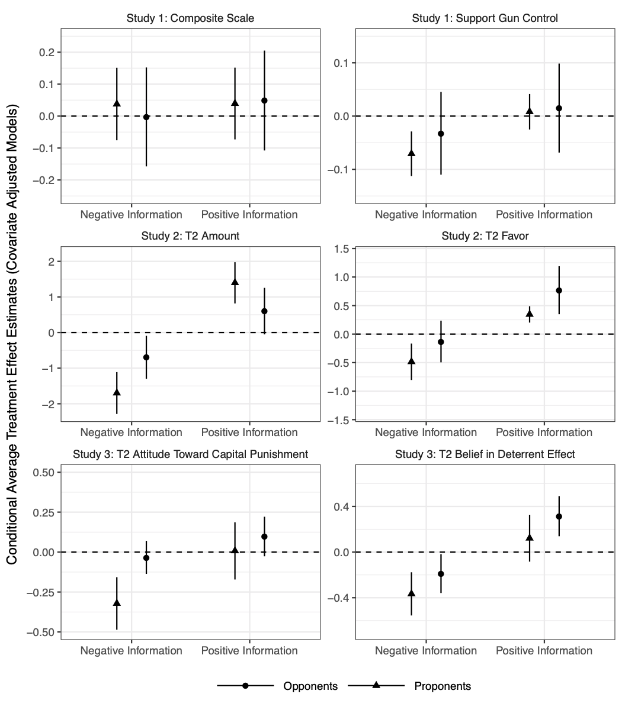

```{r setup, include=FALSE}
knitr::opts_chunk$set(echo = TRUE)
```

Guess, Andrew and Alexander Coppock. 2020. <b>Does Counter-Attitudinal Information Cause Backlash? Results from Three Large Survey Experiments</b>. British Journal of Political Science 50(4): 1497&ndash;1515. <a href='https://doi.org/10.1017/s0007123418000327' target='_blank'>doi:10.1017/s0007123418000327</a>


# Abstract

Several theoretical perspectives suggest that when individuals are exposed to counter-attitudinal evidence or arguments, their pre-existing opinions and beliefs are reinforced, resulting in a phenomenon sometimes known as ‘backlash’. This article formalizes the concept of backlash and specifies how it can be measured. It then presents the results from three survey experiments – two on Mechanical Turk and one on a nationally representative sample – that find no evidence of backlash, even under theoretically favorable conditions. While a casual reading of the literature on information processing suggests that backlash is rampant, these results indicate that it is much rarer than commonly supposed.

# Links

 - <a href='guess_coppock_2020.pdf' target='_blank'>Link to paper</a>
 - <a href='guess_coppock_2020_appendix.pdf' target='_blank'>Link to appendix</a>
 - <a href='https://doi.org/10.1017/S0007123418000327' target='_blank'>Journal site</a>
 - <a href='https://doi.org/10.7910/DVN/J7WNTM' target='_blank'>Replication archive</a>
 - <a href='https://osf.io/y9vdr' target='_blank'>Preanalysis plan</a>
 - <a href='https://osf.io/5gdes' target='_blank'>Preanalysis plan 2</a>
 - <a href='https://andyguess.com' target='_blank'>Andrew Guess's website</a>
 - <a href='guess_coppock_2020.txt' target='_blank'>Bibtex citation</a>
# Figure
<center></center>