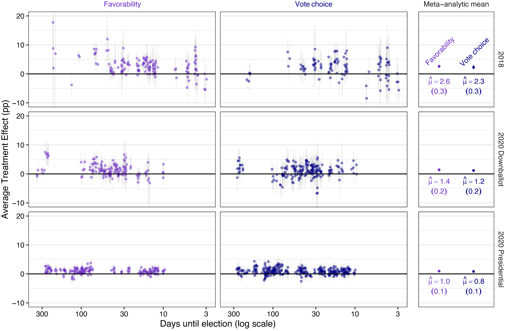

```{r setup, include=FALSE}
knitr::opts_chunk$set(echo = TRUE)
```

Hewitt, Luke, David Broockman, Alexander Coppock, Ben M. Tappin, James Slezak, Valerie Coffman, Nathaniel Lubin, Mohammad Hamidian. 2024. <b>How experiments help campaigns persuade voters: Evidence from hundreds of campaigns' own experiments</b>. American Political Science Review.

# Abstract
Political campaigns increasingly conduct experiments to learn how to persuade voters. Little research has considered the implications of this trend for elections or democracy. To probe these implications, we analyze a unique archive of 146 advertising experiments conducted by US campaigns in 2018 and 2020 using the platform Swayable. This archive includes 617 advertisements produced by 51 campaigns and tested with over 500,000 respondents. Importantly, we analyze the complete archive, avoiding publication bias. We find small but meaningful variation in the persuasive effects of advertisements. In addition, we find that common theories about what makes advertising persuasive have limited and context-dependent power to predict persuasiveness. These findings indicate that experiments can compound money’s influence in elections: it is difficult to predict ex ante which ads persuade, experiments help campaigns do so, but the gains from these findings principally accrue to campaigns well-financed enough to deploy these ads at scale.

# Links
 - <a href='hewitt_etal_2024.pdf' target='_blank'>Link to paper</a>
 - <a href='hewitt_etal_2024_all_appendicies.pdf'target='_blank'>Link to appendix</a>
 - <a href='https://doi.org/10.1017/S0003055423001387'target='_blank'>Journal site</a>
 - <a href='https://doi.org/10.7910/DVN/LBPSSV'target='_blank'>Replication archive</a>
 - <a href='https://osf.io/q276a'target='_blank'>Preanalysis plan</a>
 - <a href='https://osf.io/5c9hx?view_only=f728d3cbc8b848dfa6bc02402828750c'target='_blank'>Preanalysis plan 2</a>

 - <a href= 'https://rhetorical.org/luke-hewitt' target='_blank'>Luke Hewitt's website</a>
 - <a href= 'https://polisci.berkeley.edu/people/person/david-edward-broockman' target='_blank'>David Broockman's website</a>
 - <a href= 'https://jslez.com/' target='_blank'>James Slezak's website</a>
 - <a href= 'https://valeriecoffman.com/' target='_blank'>Valerie Coffman's website</a>
 - <a href= 'https://www.natelubin.com/' target='_blank'>Nathaniel Lubin's website</a>
 - <a href= 'https://scholar.google.com/citations?user=Pn6LXtcAAAAJ&hl=en' target='_blank'>Mohammad Hamidian's website</a>
 - <a href='hewitt_etal_2024.txt'target='_blank'>Bibtex citation</a>

# Figure
<center></center>