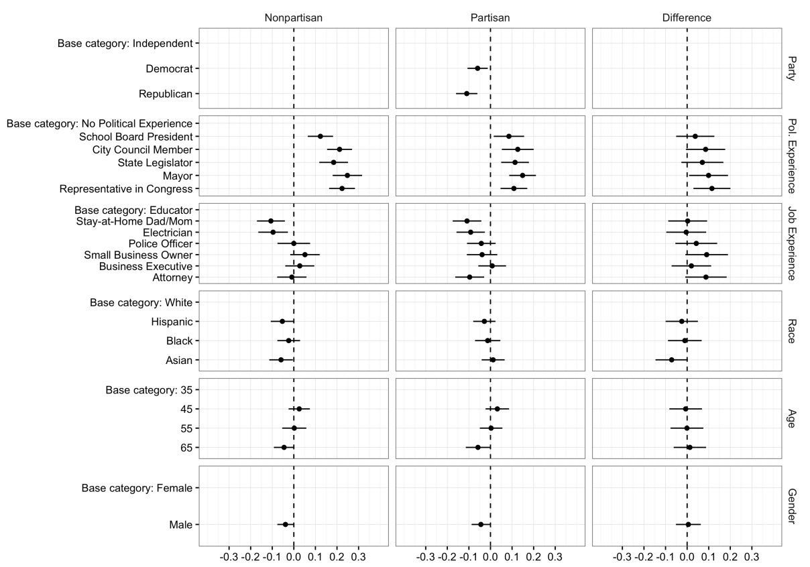

```{r setup, include=FALSE}
knitr::opts_chunk$set(echo = TRUE)
```

Kirkland, Patricia A., Alexander Coppock. 2018. Candidate Choice Without Party Labels: New Insights from Conjoint Survey Experiments. Political Behavior.

# Abstract
In the absence of party labels, voters must use other information to infer candidates’ ideology and competence. The institution of nonpartisan elections, therefore, may impact voter choice by increasing the weight that voters place on other dimensions of candidate quality. We hypothesize that in nonpartisan elections, voters will exhibit a stronger preference for more competent candidates, as measured by both their career and political experience. The existing evidence in favor of this hypothesis mainly comes from a handful of observational studies; to date, few if any experimental studies have rigorously evaluated this claim. We conducted conjoint survey experiments on both nationally representative and convenience samples. The results of these experiments indicate that when subjects cannot rely on party labels to infer ideological positions, they give greater weight to candidate competence. We find that this process unfolds differently for respondents of different partisan affiliations: Republicans give greater weight to job experience while Democrats give greater weight to political experience. We explore the generalizability of results obtained with online convenience samples by showing a strong correlation with results obtained on a nationally representative sample.

# Links
 - <a href='kirkland_coppock_2018.pdf'>Link to paper</a>
 - <a href='kirkland_coppock_2018_appendix.pdf'>Link to appendix</a>
 - Journal site: https://doi.org/10.1007/s11109-017-9414-8 
 - Replication archive: https://doi.org/10.7910/DVN/WSUHI3 

- Patricia A. Kirkland's website: https://patriciakirkland.com

# Figure
<center></center>