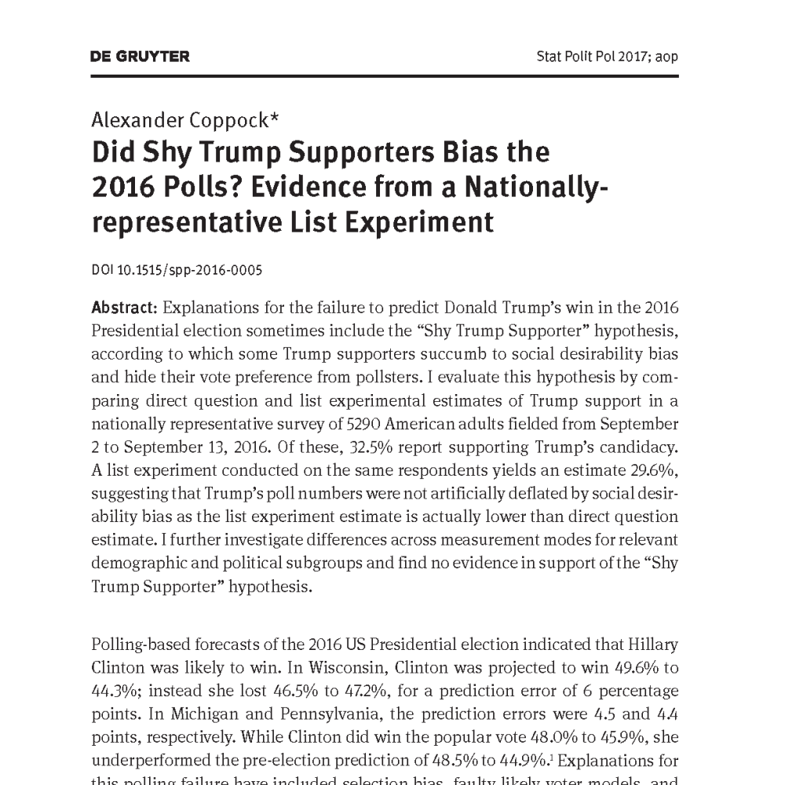
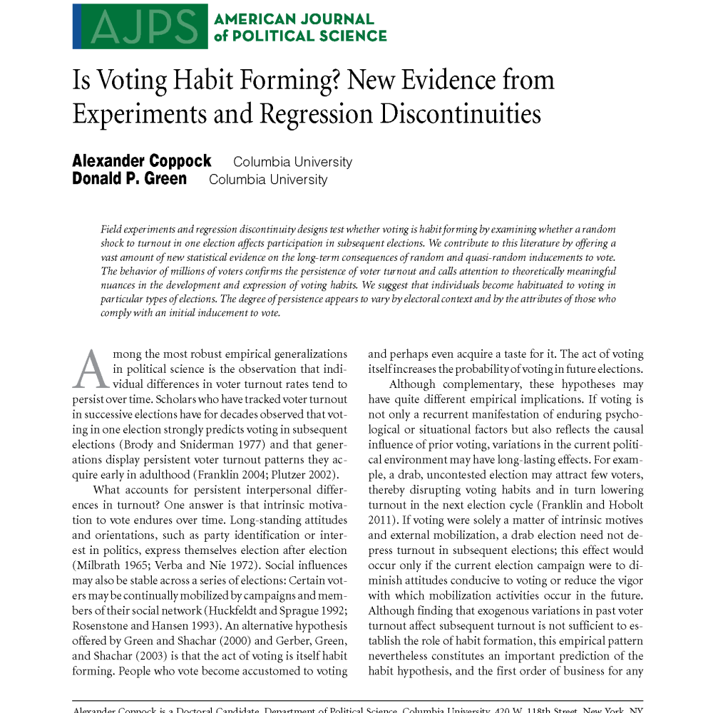
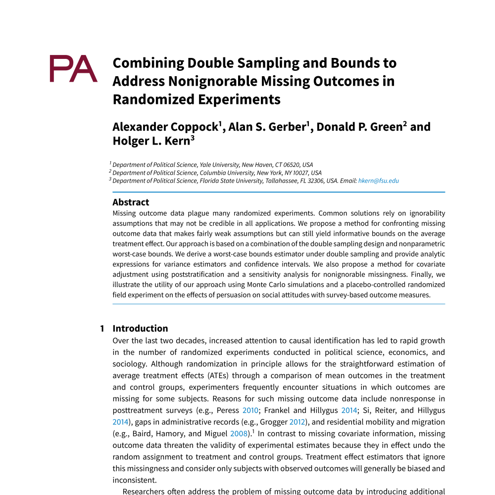

<!--html_preserve-->

   
 Political Attitudes and Behaviors

   

   
   

			
			<a href="projectpages_YRC_BWC.html" class="galleryItemLabel">Evaluating the Effects of Police Body-Worn Cameras: A Randomized Controlled Trial</a>
			
Proceedings of the National Academy of Sciences, May 2019, with David Yokum and Anita Ravishankar.

		

		
      

         
         <a href="projectpages_GC_prevalence.html" class="galleryItemLabel">Does Counter-Attitudinal Information Cause Backlash? Results from Three Large Survey Experiments</a>
         
British Journal of Political Science, forthcoming, with Andrew Guess.

      

      

         
         <a href="projectpages_FC_spanish.html" class="galleryItemLabel">Do Bilinguals Respond More Favorably to Candidate Advertisements in English or in Spanish?</a>
         
Political Communication, forthcoming, with Alejandro Flores.

      

      

         
         <a href="projectpages_CEK_opeds.html" class="galleryItemLabel">The Long-lasting Effects of Newspaper Op-Eds on Public Opinion</a>
         
Quarterly Journal of Political Science, 2018, with Emily Ekins and David Kirby.

      

      

         
         <a href="projectpages_KC_nonpartisan.html" class="galleryItemLabel">Candidate Choice without Party Labels: New Insights from U.S. Mayoral Elections 1945-2007 and Conjoint Survey Experiments</a>
         
Political Behavior, 2018, with Patricia Kirkland

      

      

         
         <a href="projectpages_Coppock_shytrump.html" class="galleryItemLabel">Did Shy Trump Supporters Bias the 2016 Polls? Evidence from a Nationally-representative List Experiment</a>
         
Statistics, Politics, and Policy, 2017.

      

      

         
         <a href="projectpages_CGT_tweets.html" class="galleryItemLabel">When Treatments Are Tweets: A Network Mobilization Experiment Over Twitter</a>
         
Political Behavior, 2015, with Andrew Guess and John Ternovski.

      

      

         
         <a href="projectpages_CG_habit.html" class="galleryItemLabel">Is Voting Habit Forming? New Evidence Suggests that Habit-Formation Varies by Election Type.</a>
         
American Journal of Political Science, 2016, with Donald P. Green.

      

      

         
         <a href="projectpages_GKCFLZ_lawnsigns.html" class="galleryItemLabel">The Effects of Lawn Signs on Vote Outcomes: Results from Four Randomized Field Experiments.</a>
         
 Electoral Studies, 2016, with Donald P. Green, Jonathan S. Krasno, Brandon Lenoir, Benjamin D. Farrer, and Josh Zingher

      

      

         
         <a href="projectpages_Coppock_information_spillovers.html" class="galleryItemLabel">Information Spillovers: Another Look at Experimental Estimates of Legislator Responsiveness.</a>
         
 Journal of Experimental Political Science, 2014.

      

   

   
 Generalizability and External Validity 

   

     

  
    <a href="projectpages_CLM_heterogeneity.html" class="galleryItemLabel">The Generalizability of Heterogeneous Treatment Effect Estimates Across Samples</a>
      
Proceedings of the National Academy of Sciences, Forthcoming, with Thomas J. Leeper, and Kevin J. Mullinix

        

        
		

			
			<a href="projectpages_CM_lucid.html" class="galleryItemLabel">Validating the Demographic, Political, Psychological, and Experimental Results Obtained from a New Source of Online Survey Respondents</a>
			
Research & Politics, Forthcoming, with Oliver A. McClellan.

		

        
              

         
         <a href="projectpages_Coppock_generalizability.html" class="galleryItemLabel">Generalizing from Survey Experiments Conducted on Mechanical Turk: A Replication Approach</a>
         
Political Science Research and Methods, forthcoming

      

        
        

         
         <a href="projectpages_CG_labfield.html" class="galleryItemLabel">Assessing the Correspondence between Experimental Results Obtained in the Lab and Field: A Review of Recent Social Science Research</a>
         
 Political Science Research and Methods, 2015, with Donald P. Green.

      

        

        
        
        
 Statistical Methods

   

			
			<a href="projectpages_BCCH_declaredesign.html" class="galleryItemLabel">Declaring and Diagnosing Research Designs</a>
			
American Political Science Review, Forthcoming, with Graeme Blair, Jasper Cooper, and Macartan Humphreys.

		

        
      

         
         <a href="projectpages_Coppock_audit_experiments.html" class="galleryItemLabel">Avoiding Post-Treatment Bias in Audit Experiments</a>
         
Journal of Experimental Political Science, forthcoming

      

      

         
         <a href="projectpages_CGGK_attrition.html" class="galleryItemLabel">Combining Double Sampling and Bounds to Address Non-ignorable Missing Outcomes in Randomized Experiments</a>
         
Political Analysis, 2017, with Alan S. Gerber, Donald P. Green, and Holger L. Kern.

      

      
      
      
      
      

         
         <a href="projectpages_ACCG_list.html" class="galleryItemLabel">Combining List Experiment and Direct Question Estimates of Sensitive Behavior Prevalence</a>
         
Journal of Survey Statistics and Methodology, 2016, with Peter M. Aronow, Forrest W. Crawford, and Donald P. Green.

      

   

<!--/html_preserve-->
