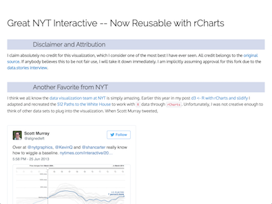
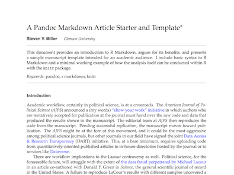
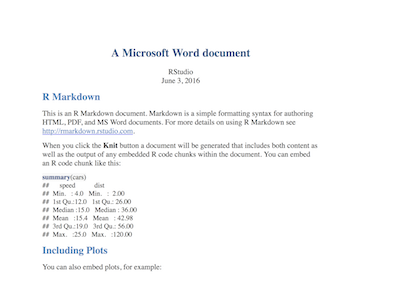
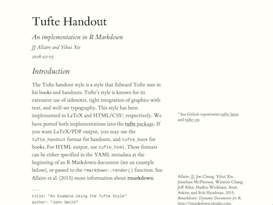

<!--html_preserve-->

  
Gallery

  
Check out the range of outputs and formats you can create using R Markdown.

  

    
Documents

    
With R Markdown, you write a single .Rmd file and then use it to render finished output in a variety of formats.

    

      

        
        <a href="http://timelyportfolio.github.io/rCharts_nyt_home_price/" class="galleryItemLabel">HTML</a>
        
HTML documents for web publishing.

      

      

        
        <a href="https://github.com/svmiller/svm-r-markdown-templates/blob/master/svm-rmarkdown-article-example.pdf" class="galleryItemLabel">PDF</a>
        
PDF documents for printing. <a href="https://raw.githubusercontent.com/svmiller/svm-r-markdown-templates/master/svm-rmarkdown-article-example.Rmd">Example Code</a>

      

      

        
        <a class="galleryItemLabel">Microsoft Word</a>
        
Microsoft Word documents for Office workflows.

      

      

        
        <a href="https://rstudio.github.io/tufte/" class="galleryItemLabel">Handouts</a>
        
Tufte styled documents for handouts. <a href="https://raw.githubusercontent.com/rstudio/tufte/master/inst/rmarkdown/templates/tufte_html/skeleton/skeleton.Rmd">Example Code</a>

      

    

  

<!--/html_preserve-->
