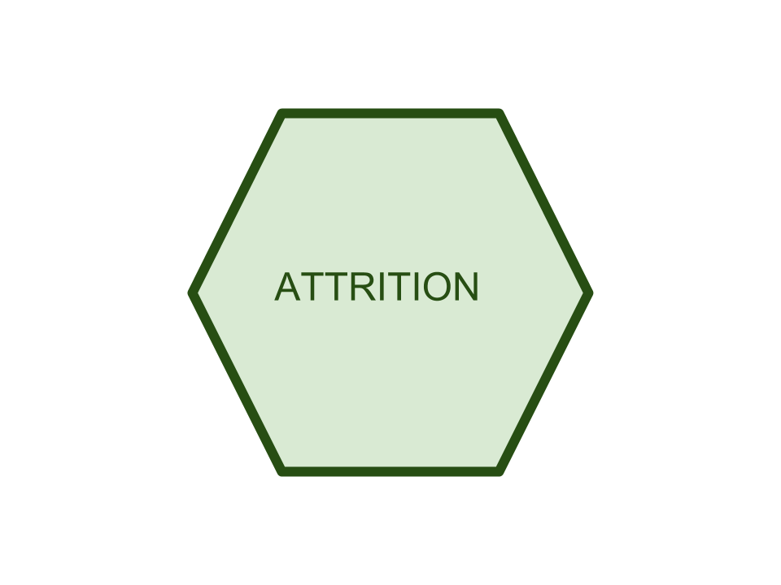
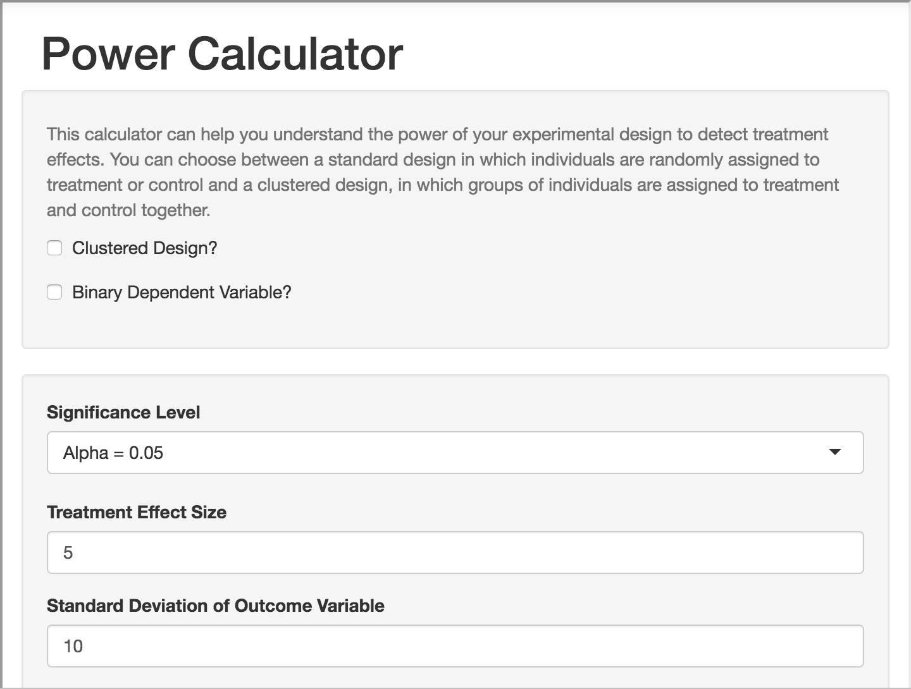
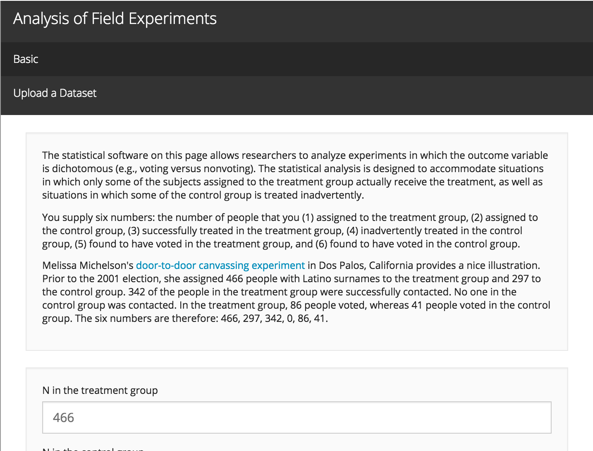
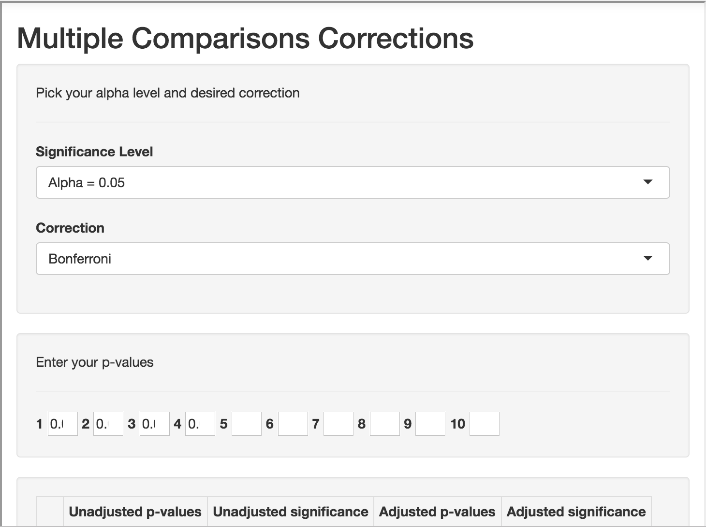
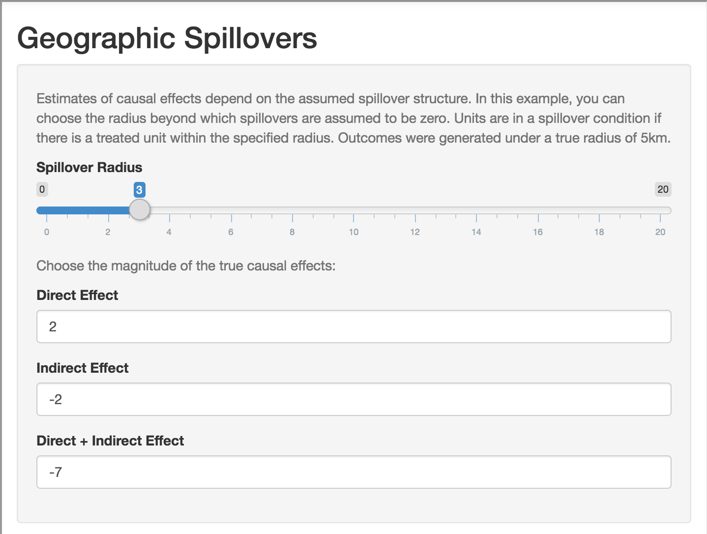
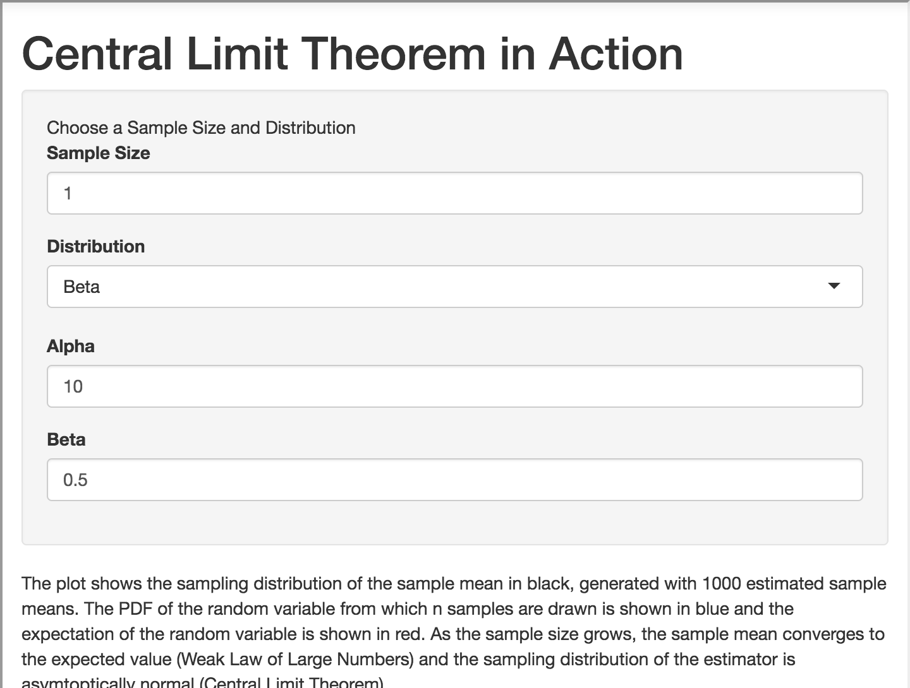

<!--html_preserve-->

  
Statistical Tools

  
  

    
R Packages (authored or contributed to)

    

    
      

        
        <a href="statistical_randomizr.html" class="galleryItemLabel">randomizr</a>
        

      

      
      

        
        <a href="statistical_list.html" class="galleryItemLabel">list</a>
        
Statistical Methods for the Item Count Technique and List Experiment

      

      
      

        
        <a href="https://declaredesign.org/" class="galleryItemLabel">DeclareDesign</a>
        

      

      

        
        <a href="statistical_comma.html" class="galleryItemLabel">commarobust</a>
        

      

      

        
        <a href="statistical_attrition.html" class="galleryItemLabel">attrition</a>
        

      

      
    

  

  

    
Shiny Apps

    
Apps that help with experimental design and analysis

    

    
      

        
        <a href="statistical_powercalculator.html" class="galleryItemLabel">Power Calculator</a>
        

      

      
      

        
        <a href="statistical_field.html" class="galleryItemLabel">Analysis of Field Experiments</a>
        

      

      
      

        
        <a href="statistical_comparisons.html" class="galleryItemLabel">Multiple Comparisons Calculator</a>
        

      

      

      

        
        <a href="statistical_geographic.html" class="galleryItemLabel">Geographic Spillover</a>
        

      

      

        
        <a href="statistical_limit.html" class="galleryItemLabel">Central Limit Theorem in Action </a>
        

      

      
    

  

<!--/html_preserve-->
