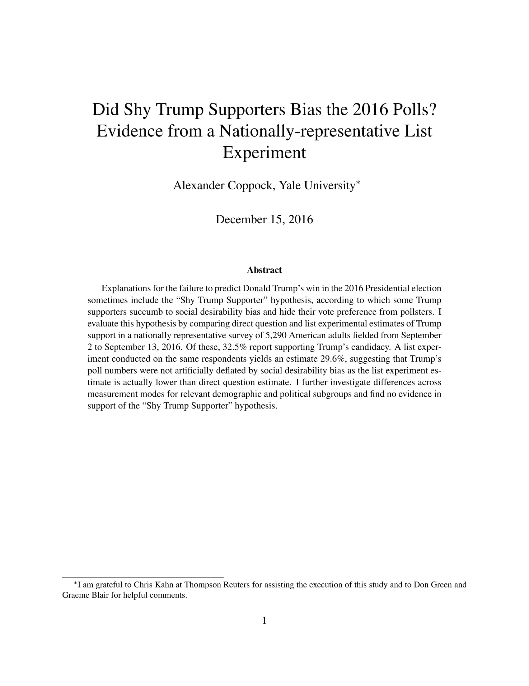
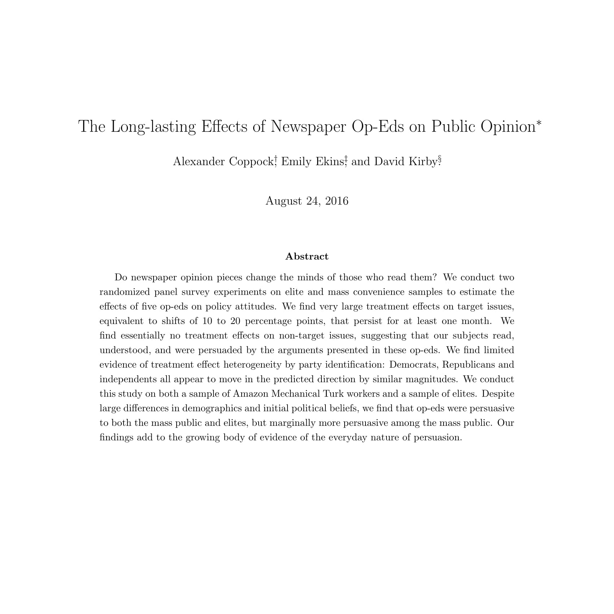
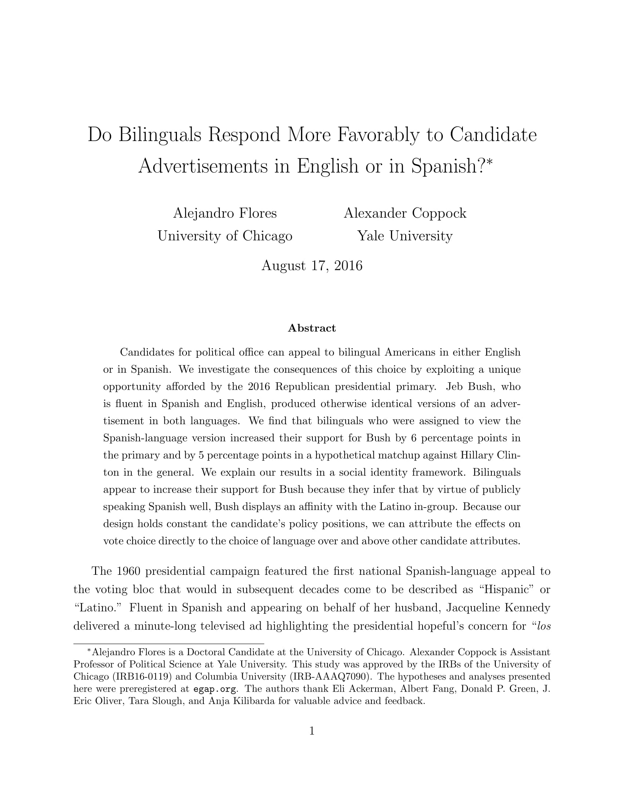
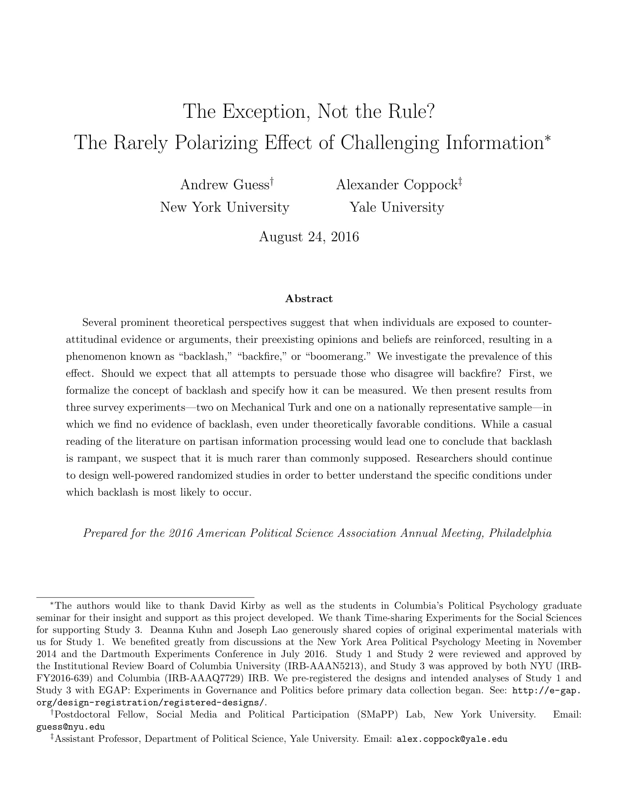
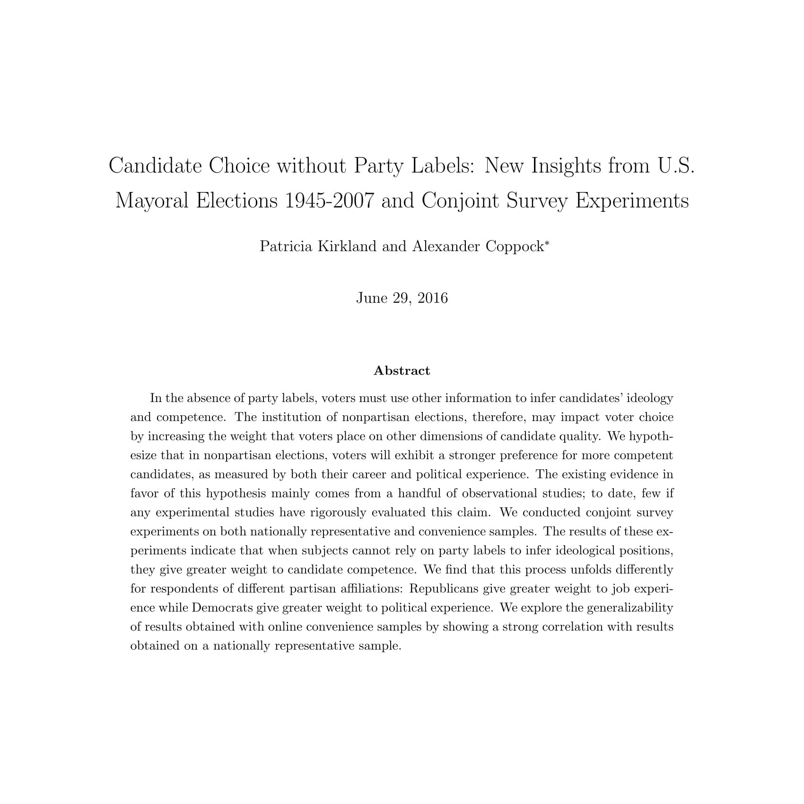
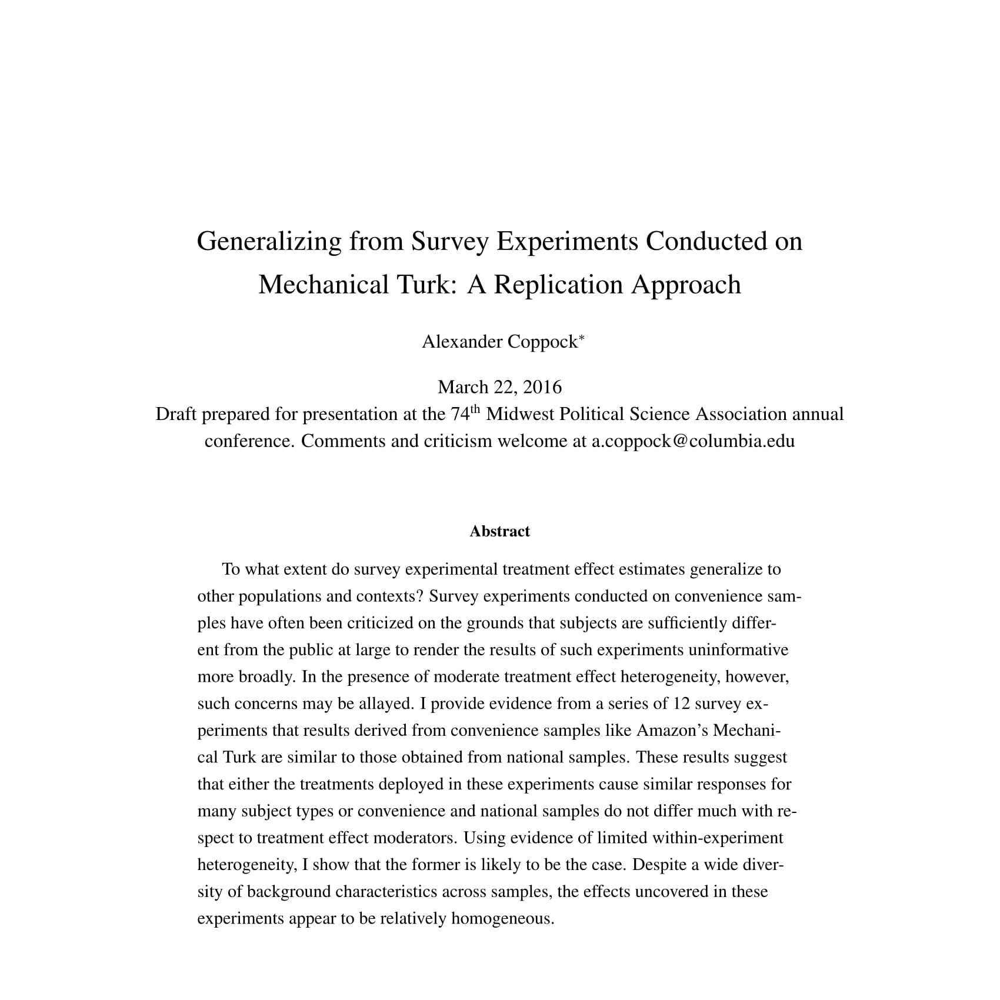
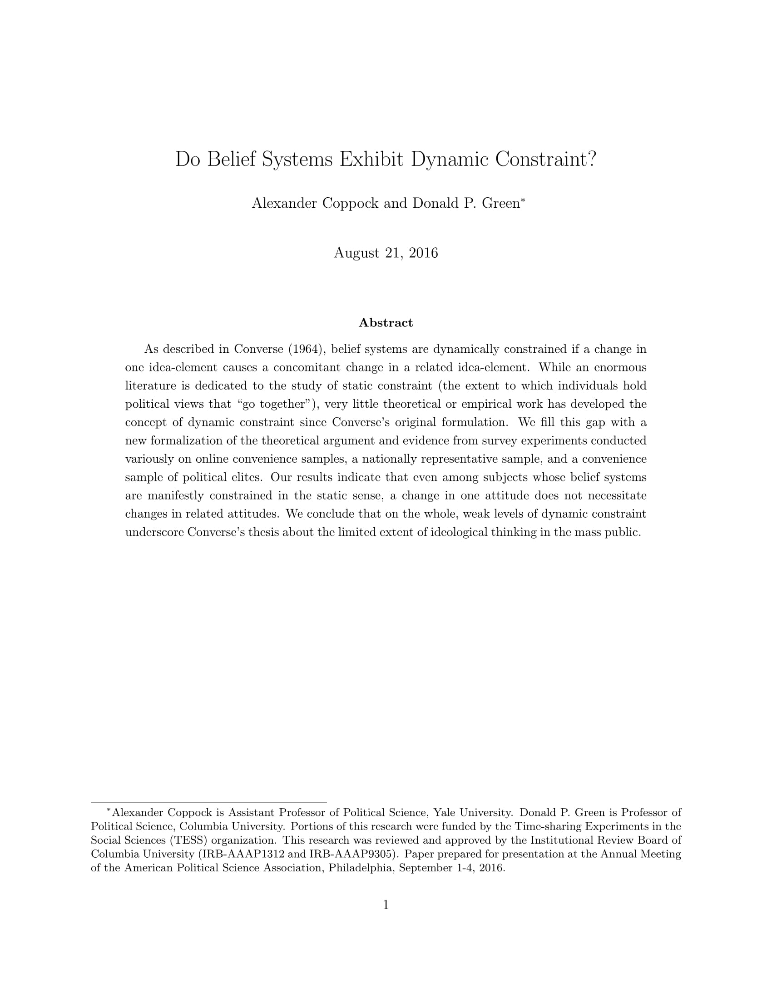

<!--html_preserve-->

  
Working Papers

  

    
 Political Attitudes and Behaviors

    

    
      

        
        <a href="projectpages_Coppock_shytrump.html" class="galleryItemLabel">Did Shy Trump Supporters Bias the 2016 Polls? Evidence from a Nationally-representative List Experiment</a>
        
Working Paper.

      

      
      
      

        
        <a href="projectpages_CEK_opeds.html" class="galleryItemLabel">The Long-lasting Effects of Newspaper Op-Eds on Public Opinion</a>
        
Working Paper.

      

      
      

        
        <a href="projectpages_FC_spanish.html" class="galleryItemLabel">Do Bilinguals Respond More Favorably to Candidate Advertisements in English or in Spanish?</a>
        
Working Paper.

      
      
      
      

        
        <a href="projectpages_GC_prevalence.html" class="galleryItemLabel">The Exception, Not the Rule? The Rarely Polarizing Effect of Challenging Information</a>
        
Working Paper.

      
      

      

        
        <a href="projectpages_KC_nonpartisan.html" class="galleryItemLabel">Candidate Choice without Party Labels: New Insights from U.S. Mayoral Elections 1945-2007 and Conjoint Survey Experiments</a>
        
Working Paper.

      
      

  

DeclareDesign
Coppock, Alexander, Donald P. Green, and Oliver A. McClellan. “Validating the

Demographic, Political, Psychological, and Experimental Results Obtained from

a New Source of Online Survey Respondents”

    
 Statistical Methods and Generalizability

    

    

      

        
        <a href="projectpages_Coppock_generalizability.html" class="galleryItemLabel">Generalizing from Survey Experiments Conducted on Mechanical Turk: A Replication Approach</a>
        
Working Paper.

      
      

      

        
        <a href="projectpages_CG_dynamicconstraint.html" class="galleryItemLabel">Do Belief Systems Exhibit Dynamic Constraint?</a>
        
Working Paper.

      

      
    
  

<!--/html_preserve-->
