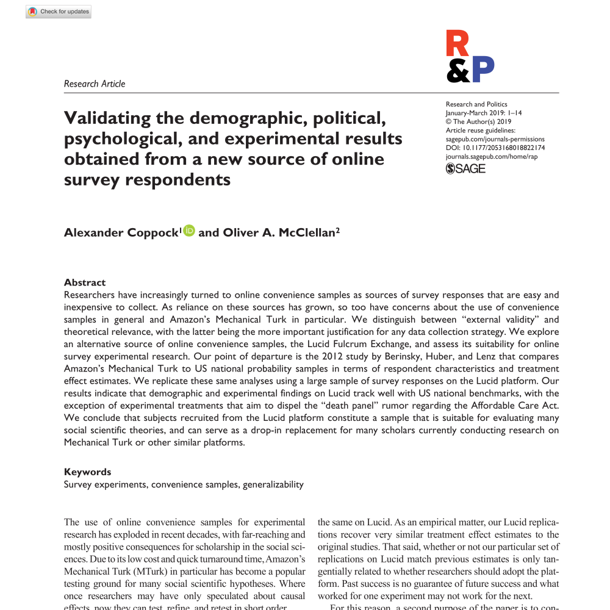

<!--html_preserve-->

  
Working Papers

  

    
 Political Attitudes and Behaviors

    

    
        

        
        <a href="projectpages_SHC_gender.html" class="galleryItemLabel">What Have We Learned About Gender From Candidate Choice Experiments? A Meta-analysis of 30 Factorial Survey Experiments</a>
        
Working Paper, with Susanne Schwartz and William Hunt

    

    
    

        
        <a href="projectpages_Coppock_trumptraders.html" class="galleryItemLabel">A Field Experimental Test of Vote Swapping</a>
        
Working Paper

    

      
    

        
        <a href="http://bwc.thelab.dc.gov/" class="galleryItemLabel">Evaluating the Effects of Police Body-Worn Cameras: A Randomized Controlled Trial</a>
        
Working Paper, with David Yokum and Anita Ravishankar.

    
  
      
    

        
        <a href="projectpages_CG_dynamicconstraint.html" class="galleryItemLabel">Do Belief Systems Exhibit Dynamic Constraint?</a>
        
Working Paper, with Donald P. Green

    

            

        
        <a href="projectpages_CKG_constitution.html" class="galleryItemLabel">A Field Experimental Test of Political Primes: Does the Constitution Affect Values, Vote Choice, or Turnout?</a>
        
Working Paper, with Donald P. Green and David Kirby.

      
    

      
      

        
        <a href="projectpages_GC_prevalence.html" class="galleryItemLabel">Does Counter-Attitudinal Information Cause Backlash? Results from Three Large Survey Experiments</a>
        
Working Paper, with Andrew Guess.

      
      

      

        
        <a href="projectpages_Coppock_persistence.html" class="galleryItemLabel">The Persistence of Survey Experimental Treatment Effects</a>
        
Working Paper

      
      

      
  

    
 Statistical Methods and Generalizability

    

    
                

        
        <a href="projectpages_CLM_heterogeneity.html" class="galleryItemLabel">Generalizability of Heterogeneous Treatment Effect Estimates</a>
        
Working Paper, with Thomas J. Leeper and Kevin J. Mullinix.

      

    
    
                

        
        <a href="projectpages_CM_lucid.html" class="galleryItemLabel">Validating the Demographic, Political, Psychological, and Experimental Results Obtained from a New Source of Online Survey Respondents</a>
        
Working Paper, with Oliver A. McClellan.

      

    
    
            

        
        <a href="projectpages_BCCH_declaredesign.html" class="galleryItemLabel">Declaring and Diagnosing Research Designs</a>
        
Working Paper, with Graeme Blair, Jasper Cooper, and Macartan Humphreys.

      

    
  

    
 Research Notes 

    

    

            

        
        <a href="papers/CB_blacklivesmatter.pdf" class="galleryItemLabel">Summary Report: The Effectiveness of Online Ads: A Field Experiment</a>
        
Research Note.

      

            

        
        <a href="subpages/Random_Assignment_Subject_To_Constraints.html" class="galleryItemLabel">Random Assignment Subject to Constraints</a>
        
Research Note.

      

    
  

<!--/html_preserve-->
