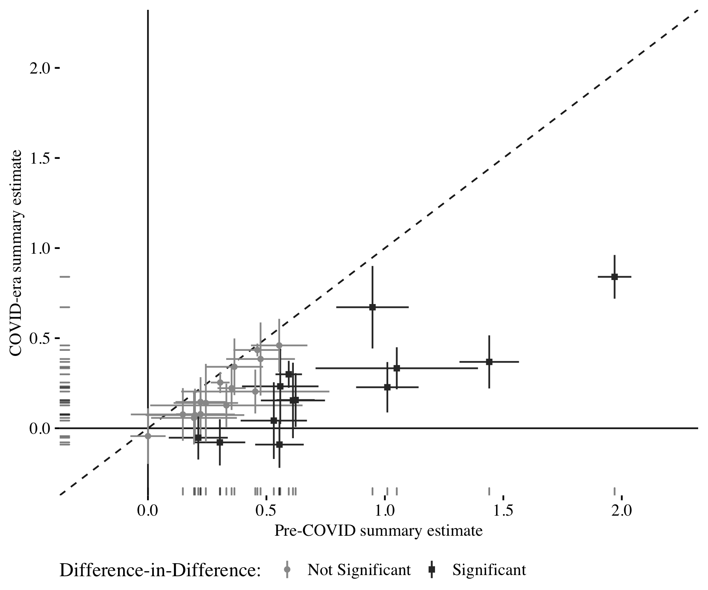

```{r setup, include=FALSE}
knitr::opts_chunk$set(echo = TRUE)
```

Peyton, Kyle, Huber, Gregory A., Coppock, Alexander. 2020. <b>The Generalizability of Online Experiments Conducted During The COVID-19 Pandemic</b>. Unpublished manuscript.

# Abstract
The disruptions of the COVID-19 pandemic led many social scientists toward online survey experimentation for empirical research. Generalizing from the experiments conducted during a period of persistent crisis may be challenging due to changes in who participates in online survey research and how the participants respond to treatments. We investigate the generalizability of COVID-era survey experiments with 33 replications of 12 pre-pandemic designs fielded across 13 surveys on American survey respondents obtained from Lucid between March and July of 2020. We find strong evidence that these experiments replicate in terms of sign and significance, but at somewhat reduced magnitudes that are possibly explained by increased inattentiveness. These findings mitigate concerns about the generalizability of online research during this period. The pandemic does not appear to have fundamentally changed how subjects respond to treatments, provided they pay attention to treatments and outcome questions. In this light, we offer some suggestions for renewed care in the design, analysis, and interpretation of experiments conducted during the pandemic.

# Links
 - <a href='peyton_huber_coppock_2020.pdf'>Link to paper</a>
 - <a href='peyton_huber_coppock_2020_appendix.pdf'>Link to appendix</a>

- Kyle Peyton's website: http://kyle-peyton.com
- Gregory A. Huber's website: https://huber.research.yale.edu

# Figure
<center></center>