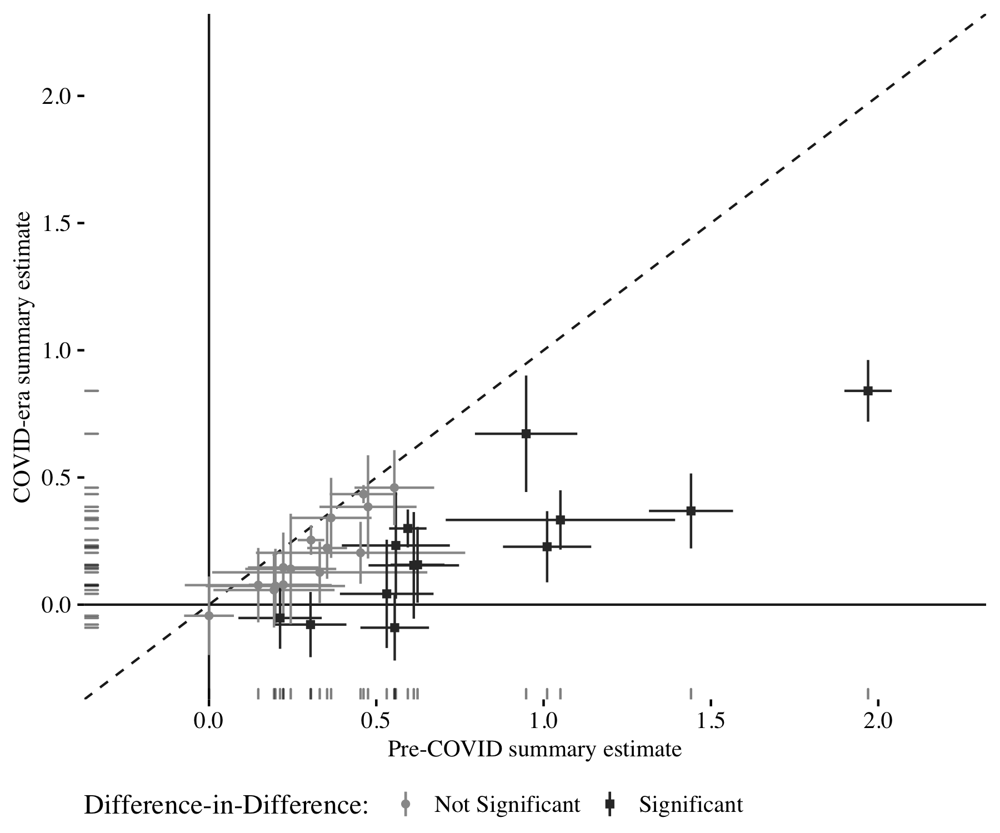

```{r setup, include=FALSE}
knitr::opts_chunk$set(echo = TRUE)
```

Peyton, Kyle, Huber, Gregory A., Coppock, Alexander. 2021. <b>The Generalizability of Online Experiments Conducted During The COVID-19 Pandemic</b>. Journal of Experimental Political Science.

# Abstract
The COVID-19 pandemic imposed new constraints on empirical research, and online data collection by social scientists increased. Generalizing from experiments conducted during this period of persistent crisis may be challenging due to changes in how participants respond to treatments or the composition of online samples. We investigate the generalizability of COVID-era survey experiments with 33 replications of 12 pre-pandemic designs, fielded across 13 quota samples of Americans between March and July of 2020. We find strong evidence that pre-pandemic experiments replicate in terms of sign and significance, but at somewhat reduced magnitudes. Indirect evidence suggests an increased share of inattentive subjects on online platforms during this period, which may have contributed to smaller estimated treatment effects. Overall, we conclude that the pandemic does not pose a fundamental threat to the generalizability of online experiments to other time periods.

# Links
 - <a href='peyton_huber_coppock_2021.pdf' target='_blank'>Link to paper</a>
 - <a href='peyton_huber_coppock_2021_appendix.pdf'target='_blank'>Link to appendix</a>

 - <a href= 'http://kyle-peyton.com' target='_blank'>Kyle Peyton's website</a>
 - <a href= 'https://huber.research.yale.edu' target='_blank'>Gregory A. Huber's website</a>
 - <a href='peyton_huber_coppock_2021.txt'target='_blank'>Bibtex citation</a>

# Figure
<center></center>