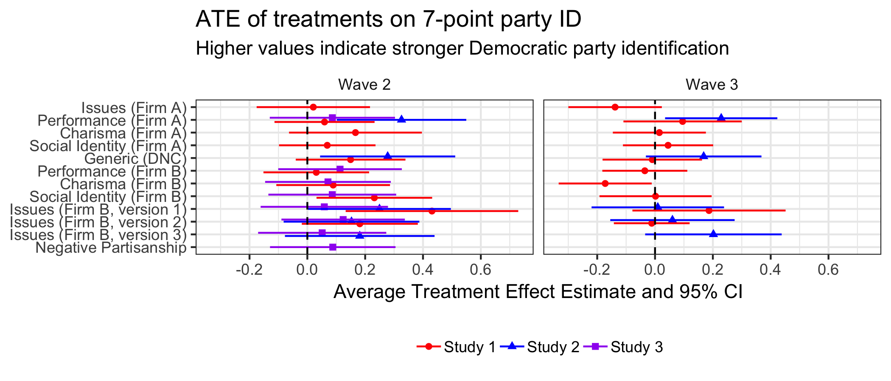

```{r setup, include=FALSE}
knitr::opts_chunk$set(echo = TRUE)
```

Alexander Coppock, Donald P. Green, and Ethan Porter (2018), "Minting Partisans: Experimental Interventions to Test Theories of Partisan Change." Working paper.

- [Working paper (September 2018)](papers/CGP_minting.pdf)
- [Online Appendix](papers/CGP_minting_appendix.pdf)
- [Donald P. Green's personal website](https://sites.google.com/site/donaldpgreen/)
- [Ethan Porters's personal website](http://www.ethanporter.com/)

## Abstract

For more than a half-century, scholars have characterized party attachments and evaluations as causes of vote choice. Because partisan attitudes have rarely been altered via experimental manipulation, this interpretation is the subject of extensive and ongoing debate, with skeptics charging that the putative causal effect of partisanship is properly attributed to policy views, retrospective evaluations, or feelings about party leaders. We attempt to break this deadlock by conducting a series of experiments designed to exogenously shift subjects' partisan affinities through the use of short videos that dramatize performance evaluations, party platforms, political personae, and social group cues. Our experiments have thus far produced only short-lived shifts in partisan attitudes, in keeping with the vast literature emphasizing the stability of party attachments. We conclude by laying out our agenda for further research.

## Figure

Figure 2 from paper, showing the effects of the videos on seven-point party ID.
<center></center>

## Bibtex citation

```
@article{coppockgreenporter2018,
  author = {Coppock, Alexander and Donald P. Green and Ethan Porter},
  title = {Minting Partisans: Experimental Interventions to Test Theories of Partisan Change},
  year = 2018,
  journal = {Unpublished manuscript}
}
```
