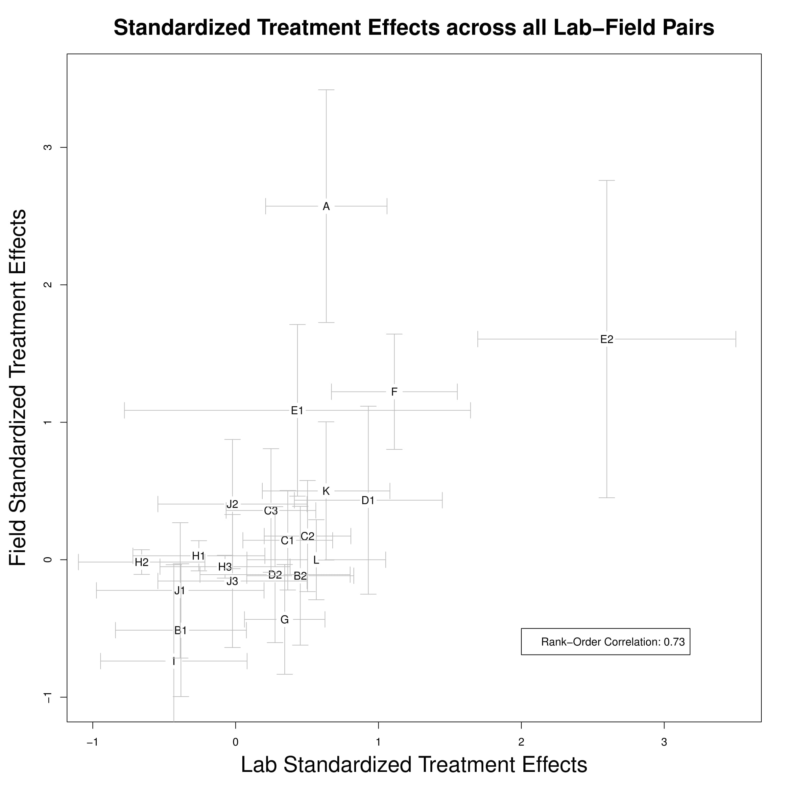

```{r setup, include=FALSE}
knitr::opts_chunk$set(echo = TRUE)
```

Coppock, Alexander and Donald P. Green (2015). Assessing the Correspondence between Experimental Results Obtained in the Lab and Field: A Review of Recent Social Science Research. Political Science Research and Methods, 3, pp 113-131

- [Journal site](https://www.cambridge.org/core/journals/political-science-research-and-methods/article/div-classtitleassessing-the-correspondence-between-experimental-results-obtained-in-the-lab-and-field-a-review-of-recent-social-science-researcha-hreffn2606-ref-typefnadiv/785631685DB69596ACC90256D332592E)
- [PDF](papers/CG_labfield.pdf)
- [Replication Archive](https://dataverse.harvard.edu/dataset.xhtml?persistentId=doi:10.7910/DVN/25543&studyListingIndex=0_15ec25376b2ce269ed7606f13125)
- [Donald P. Green's personal website](https://sites.google.com/site/donaldpgreen/)

## Abstract

A small but growing social science literature examines the correspondence between experimental results obtained in lab and field settings. This article reviews this literature and reanalyzes a set of recent experiments carried out in parallel in both the lab and field. Using a standardized format that calls attention to both the experimental estimates and the statistical uncertainty surrounding them, the study analyzes the overall pattern of lab-field correspondence, which is found to be quite strong (Spearman's rho = 0.73). Recognizing that this correlation may be distorted by the ad hoc manner in which lab-field comparisons are constructed (as well as the selective manner in which results are reported and published), the article concludes by suggesting directions for future research, stressing in particular the need for more systematic investigation of treatment effect heterogeneity.

## Figure

Figure 2 from paper, showing a scatterplot of effects obtained in the lab and in the field:

<center></center>

## Bibtex citation

```
@article{Coppock2015,
	Author = {Coppock, Alexander and Green, Donald P.},
	Journal = {Political Science Research and Methods},
	Number = {1},
	Pages = {113--131},
	Title = {{Assessing the Correspondence Between Experimental Results Obtained in the Lab and Field: A Review of Recent Social Science Research}},
	Volume = {3},
	Year = {2015},
	Bdsk-Url-1 = {http://dx.doi.org/10.1017/psrm.2014.10}}
```
