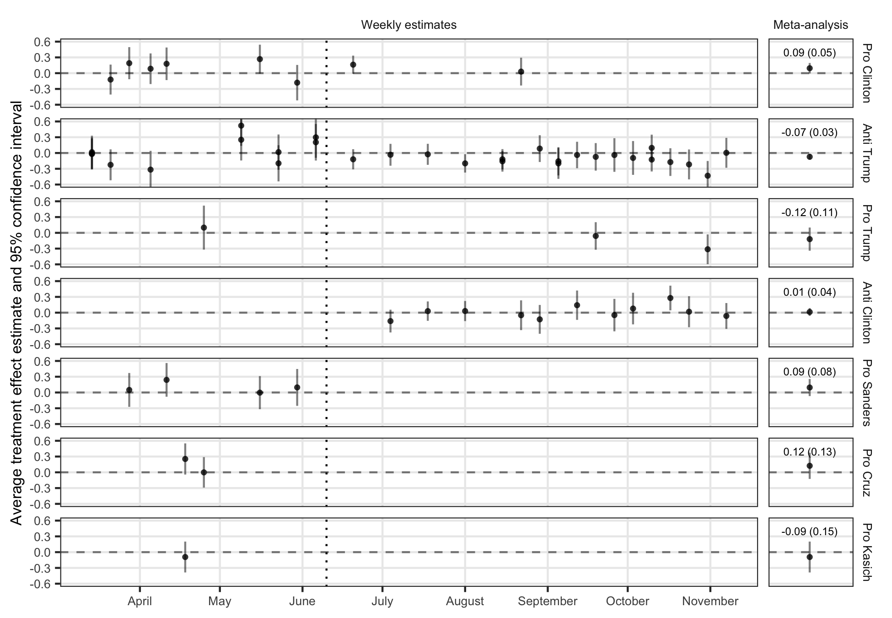

```{r setup, include=FALSE}
knitr::opts_chunk$set(echo = TRUE)
```

Alexander Coppock, Seth J. Hill, and Lynn Vavreck (2019), "Persuasive Effects of Presidential Campaign Advertising: Results of 53 Real-time Experiments in 2016" Working paper.

- [Working paper (August 2019)](papers/CHV_ads.pdf)
- [Online Appendix](papers/CHV_ads_appendix.pdf)
- [Seth J. Hill's personal website](http://sethjhill.com/)
- [Lynn Vavreck's personal website](https://www.lynnvavreck.com)

## Abstract

In this letter, we report the results of 53 randomized advertising experiments conducted over 29 weeks on 34,000 people during the US 2016 Presidential election. Our treatments were drawn in real time from advertisements on air each week. The ads vary on many dimensions: election type (primary or general), tone (attack or promotional), sponsor (candidates or Super PACS), context (timing), and content (topics). We manipulate which ads respondents see, when they see them, whether they see more than one ad, which ad they see first, and whether they see competing, reinforcing, or no additional information. Owing to the large size of our study, the meta-analytic estimates of the average treatment effects on favorability and vote choice are sometimes distinguishable from zero, but are always quite modest, even accounting for variation across advertisements and contexts.

## Figure

Figure 1 from paper, showing the effects of the ads on target candidate favorability.
<center></center>