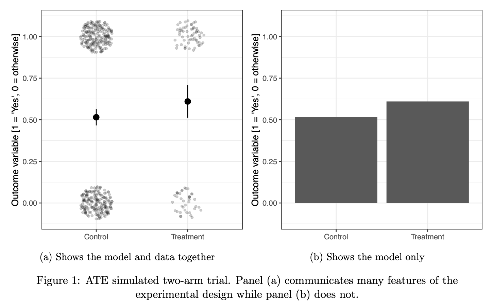
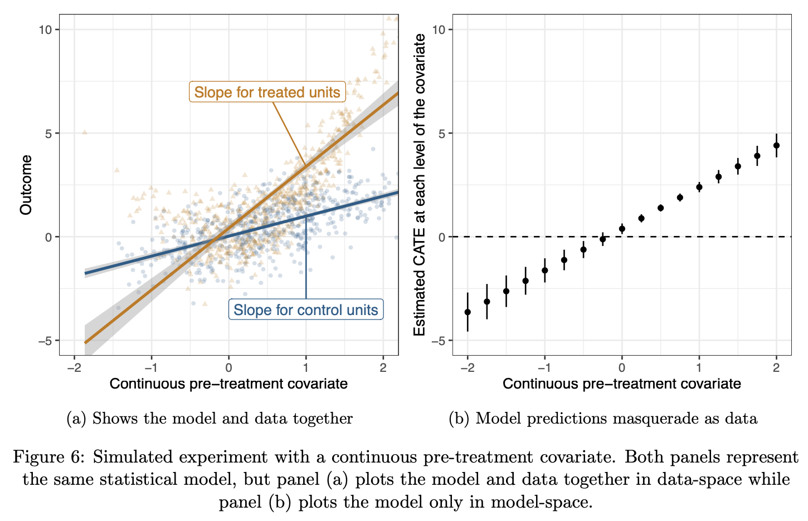

Coppock, Alexander. 2020. "Visualize as You Randomize: Design-Based Statistical Graphs for Randomized Experiments" Prepared for inclusion in Advances in Experimental Political Science, James N. Druckman and Donald P. Green, eds.

- [Pre-production Draft](papers/Coppock_VAYR.pdf)
- [Replication Archive](https://doi.org/10.7910/DVN/VE6VSR)

A good statistical graph for a randomized experiment simultaneously conveys the study's design, analysis, and results. It reveals the experimental design by mapping design elements to aesthetic parameters. It illuminates the analysis by plotting the statistical model in "data-space." When the design and analysis of an experiment are encoded in a plot, the interpretation of the experimental results is clarified. "Analyze as you randomize" is a dictum attributed to Fisher that guides interpretations of experimental data. This chapter extends that principle to visualizations of randomized experiments. While not every experiment requires a visualization, those that do should be visualized in ways that communicate the design and results together. 

# Example Figures

