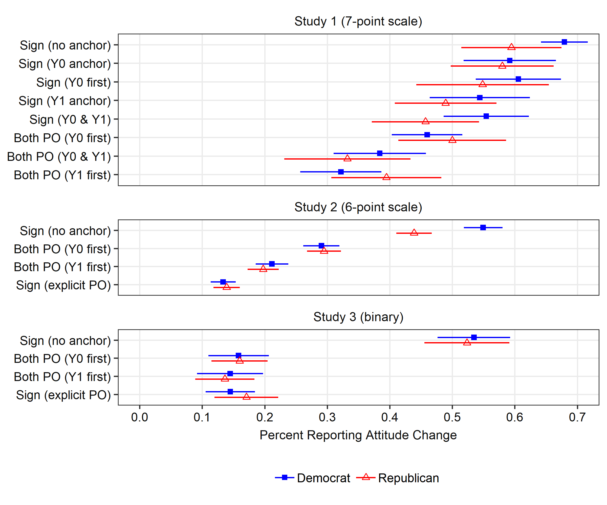

```{r setup, include=FALSE}
knitr::opts_chunk$set(echo = TRUE)
```

Matthew Graham and Alexander Coppock (2018), "The Perils of Self-Assessed Attitude Change." Working paper.

- [Working paper (September 2018)](papers/GC_perils.pdf)
- [Online Appendix](papers/GC_perils_appendix.pdf)
- [Matthew Graham's personal website](https://politicalscience.yale.edu/people/matthew-graham)

## Abstract

Surveys often ask respondents to self-report how events or information changed their attitudes. Does [event X] make you more or less likely to vote for a politician?; How did [information X] affect your opinion?; Would you be more supportive of a candi- date who took [position X]? We show that the self-assesment question type exhibits poor measurement properties. Using eight mini-experiments, we compare this question type - and two other ways of asking subjects to assess counterfactuals - to randomized experiments. When asked to report how their attitudes change, subjects appear to frequently overestimate the magnitude of treatment effects and sometimes get the sign wrong. Our first set of alternative formats, which "anchors" respondents by eliciting their absolute level of support for a candidate or policy, reduces these tendencies. Our second set of alternative formats, which asks respondents to report both of their potential outcomes, approximates experimental benchmarks surprisingly well.

## Figure

Figure 2 from paper, showing the effect of alternative question formats on reporting change.

<center></center>

## Bibtex citation

```
@article{graham2018perils,
	Author = {Graham, Matthew and Alexander Coppock},
	Journal = {Unpublished manuscript},
	Title = {The Perils of Self-Assessed Attitude Change},
	Year = 2018}
```
