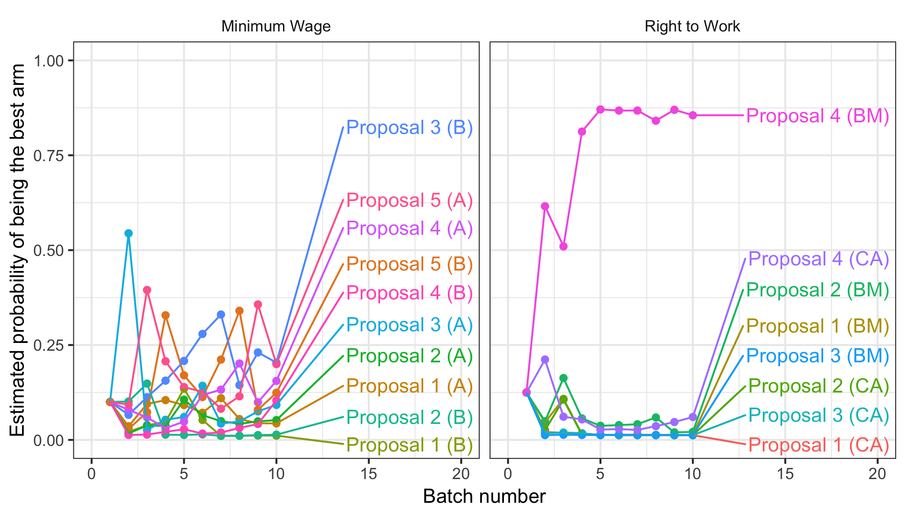

```{r setup, include=FALSE}
knitr::opts_chunk$set(echo = TRUE)
```

Molly Offer-Westort, Alexander Coppock, and Donald P. Green (2018), "Adaptive Experimental Design: Prospects and Applications in Political Science." Working paper.

- [Working paper (September 2018)](papers/OCG_adaptive.pdf)
- [Molly Offer-Westort's personal website](https://mollyow.github.io/)
- [Donald P. Green's personal website](https://sites.google.com/site/donaldpgreen/)

## Abstract

Experimental researchers in political science frequently face the following inference problem: Which of several treatment arms produces the greatest return (where returns may be expressed in terms of campaign donations, new supporters of a political cause, adherents to a policy, etc.)? Multi-arm trials are typically conducted using a static design in which fixed proportions of the subject pool are allocated to each arm. However, a growing statistical literature suggests that adaptive experimental designs may be far more efficient in finding the most effective treatment arm. An important class of adaptive designs uses probability matching strategies to dynamically allocate subjects to treatment arms. We review the underlying assumptions of the multi-arm bandit framework and suggest that it has many potential applications in political science. We discuss the design and analysis of original experiments using this approach and compare their efficiency to a more traditional static design.

## Figure

Figure 5 from paper, showing the posterior probability of each arm being best after each batch of subjects.
<center></center>

## Bibtex citation

```
@article{coppockgreenporter2018,
  author = {Offer-Westort, Molly and Alexander Coppock and Donald P. Green},
  title = {Adaptive Experimental Design: Prospects and Applications in Political Science},
  year = 2018,
  journal = {Unpublished manuscript}
}
```
