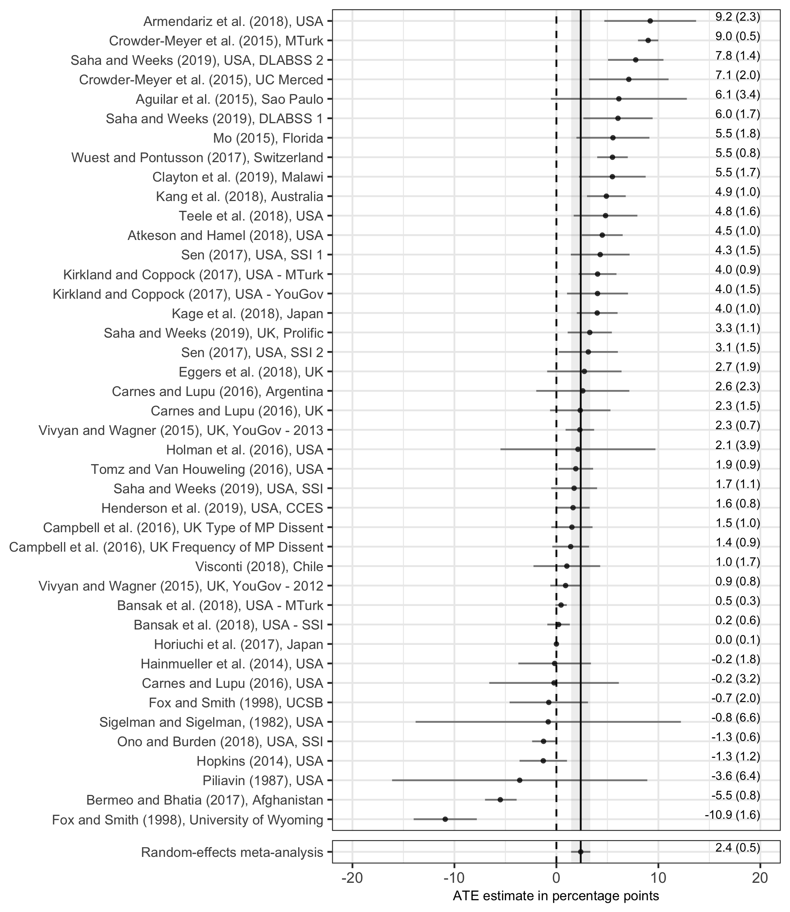

```{r setup, include=FALSE}
knitr::opts_chunk$set(echo = TRUE)
```

Schwarz, Susanne, and Alexander Coppock. 2019. “What Have We Learned About Gender From Candidate Choice Experiments? A Meta-analysis of 42 Factorial Survey Experiments” 

- [Paper](papers/SC_gender.pdf)
- [Appendix](papers/SC_gender_appendix.pdf)

## Abstract

Candidate choice survey experiments in the form of conjoint or vignette experiments have become a standard part of the political science toolkit for understanding voters' multidimensional preferences over candidates. By our count, the most common attribute studied in these experiments is candidate gender. We collect 42 studies and reanalyze them using a standardized statistical approach. We find that respondents prefer women by an average of 2 percentage points. We find some evidence of heterogeneity as the female preference appears to be somewhat larger for white (versus non-white) candidates, among female (versus male) respondents, and among Democrats and Independents (versus Republicans). We demonstrate the external validity of these survey experimental estimates with an observational analysis of putatively male and female candidates in low-salience elections. Our results add to the growing body of evidence that voter preferences are not a major factor explaining the persistently low rates of women in elected office.

## Figure

Figure 1 from paper, showing the results of 42 estimates of the effect of gender in candidate choice survey experiments

<center></center>

