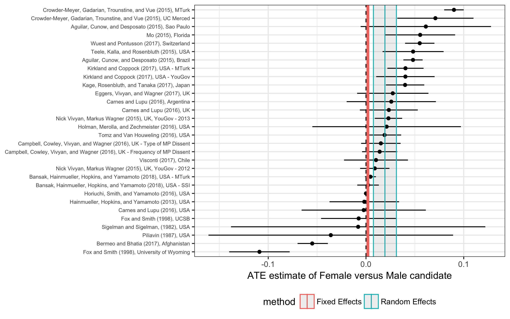

```{r setup, include=FALSE}
knitr::opts_chunk$set(echo = TRUE)
```

Schwarz, Susanne, William Hunt, and Alexander Coppock. 2018. “What Have We Learned About Gender From Candidate Choice Experiments? A Meta-analysis of 30 Factorial Survey Experiments” 

- [Paper](papers/SHC_gender.pdf)

## Abstract

Candidate choice survey experiments in the form of conjoint or vignette experiments have become a standard part of the political science toolkit for understanding voters' multidimensional preferences over candidates. These experiments have been used to study many candidate attributes, such as policy position, race, age, political or career experience, attractiveness, and political party. By our count, the most common attribute studied in these experiments is candidate gender. We collect 30 such experiments and reanalyze them using a standardized statistical approach. Holding other candidate features fixed by design, female candidates are on average preferred by respondents by approximately 2 percentage points. We further investigate how this preference varies with respondent gender and partisanship and other candidate characteristics. We find limited evidence of heteogeneity, though the female preference appears to be somewhat smaller for black (versus white) candidates and among Republican (versus Democratic) respondents. We conclude by attempting to reconcile the disjunction between the unambiguous survey experimental results and the drastic underprovision of female elected representatives

## Figure

Figure 1 from paper, showing the results of 30 estimates of the effect of gender in candidate choice survey experiments

<center></center>

## Bibtex citation

```
@article{schwarz2018
	Author = {Schwarz, Susanne and William Hunt and Alexander Coppock},
	Title = {What Have We Learned About Gender From Candidate Choice Experiments? A Meta-analysis of 30 Factorial Survey Experiments},
	Journal = {Unpublished Manuscript},
	Year = {2018}
}
```
