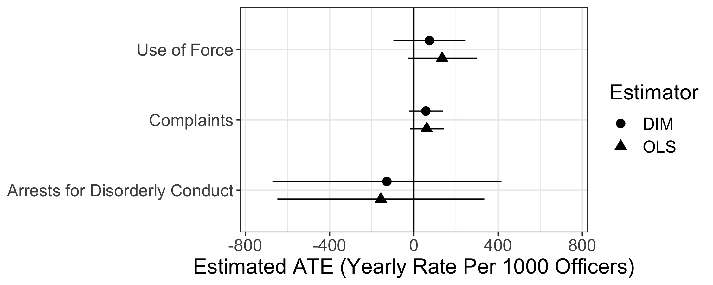

```{r setup, include=FALSE}
knitr::opts_chunk$set(echo = TRUE)
```

David Yokum, Anita Ravishankar, and Alexander Coppock. 2019. "A randomized control trial evaluating the effects of police body-worn cameras." \textit{Proceedings of the National Academy of Sciences}.

- [Preprint](https://bwc.thelab.dc.gov/TheLabDC_MPD_BWC_Working_Paper_10.20.17.pdf)
- [Link to Journal](https://www.pnas.org/content/early/2019/05/06/1814773116)
- [Supplementary Materials](papers/YRC_BWC_appendix.pdf)
- [David Yokum](https://thelab.dc.gov/david.html)
- [Anita Ravishankar](http://fordschool.umich.edu/phd-students/anita-ravishankar)

## Abstract

Police body-worn cameras (BWCs) have been widely promoted as a technological mechanism to improve policing and the perceived legitimacy of police and legal institutions, yet evidence of their effectiveness is limited. To estimate the effects of BWCs, we con- ducted a randomized controlled trial involving 2,224 Metropolitan Police Department officers in Washington, DC. Here we show that BWCs have very small and statistically insignificant effects on police use of force and civilian complaints, as well as other policing activities and judicial outcomes. These results suggest we should recalibrate our expectations of BWCs’ ability to induce large-scale behavioral changes in policing, particularly in contexts similar to Washington, DC.

## Figure

Figure 1 from paper, showing the estimated treatment effects on use of force, complaints, and arrests for disorderly conduct.

<center></center>

